# SettingAgent RPC화 — 설계 다이어그램

> 작성일: 2026-07-28 18:46 · 브랜치 `worktree-feat-rpc-control-plane`
> 본문 설계서: [20260728_183010_SettingAgent_서버_RPC화_설계서.md](20260728_183010_SettingAgent_서버_RPC화_설계서.md)
> 이 문서는 **구현 착수 전 확정용 그림**입니다. 코드 구조·호출 흐름·데이터 정본·안전 게이트를 그림으로 고정한 뒤 구현합니다.

---

## 1. 컨텍스트 — 누가 SettingAgent 를 제어하는가

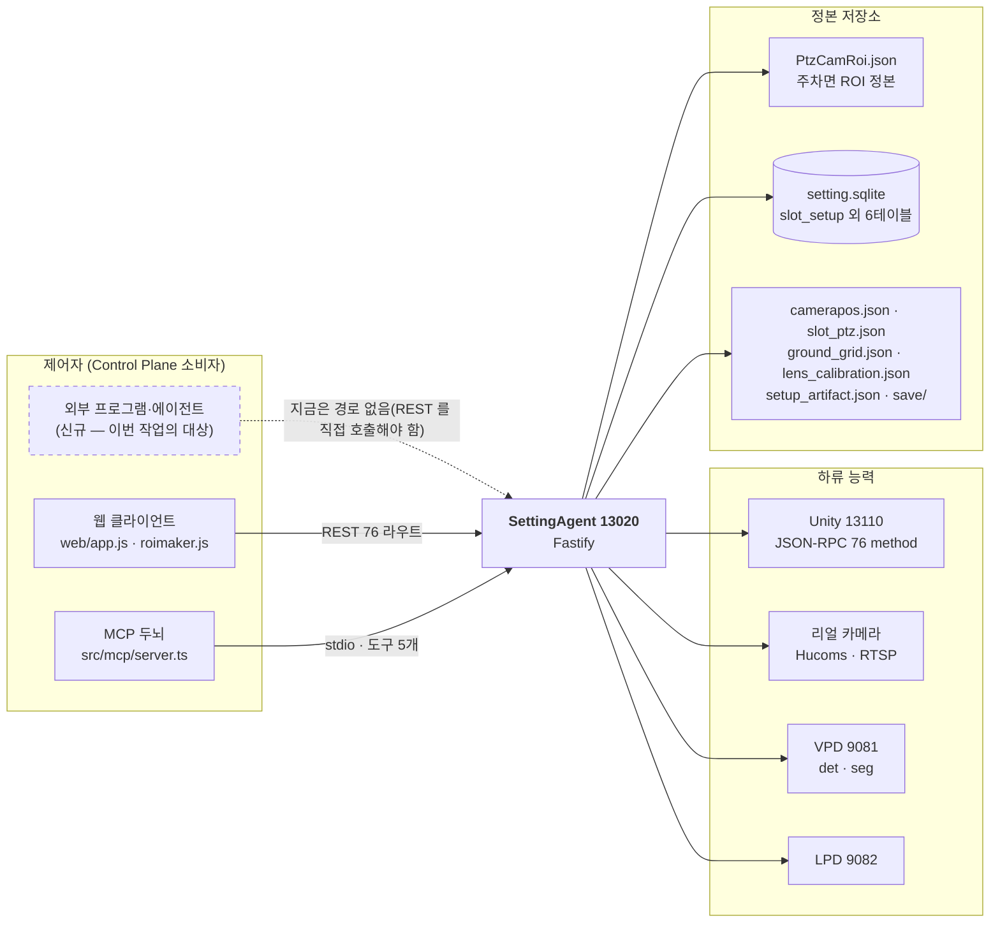

**문제**: 외부 제어자가 셋팅을 하려면 REST 76 라우트의 경로·본문·상태코드를 전부 알아야 하고, **웹 클라이언트에만 있는 로직 12건**(주차면 단건 편집·자동보정 적용·전역번호 자동부여 등)은 아예 흉내낼 수 없습니다.

---

## 2. To-Be — 단일 제어 평면

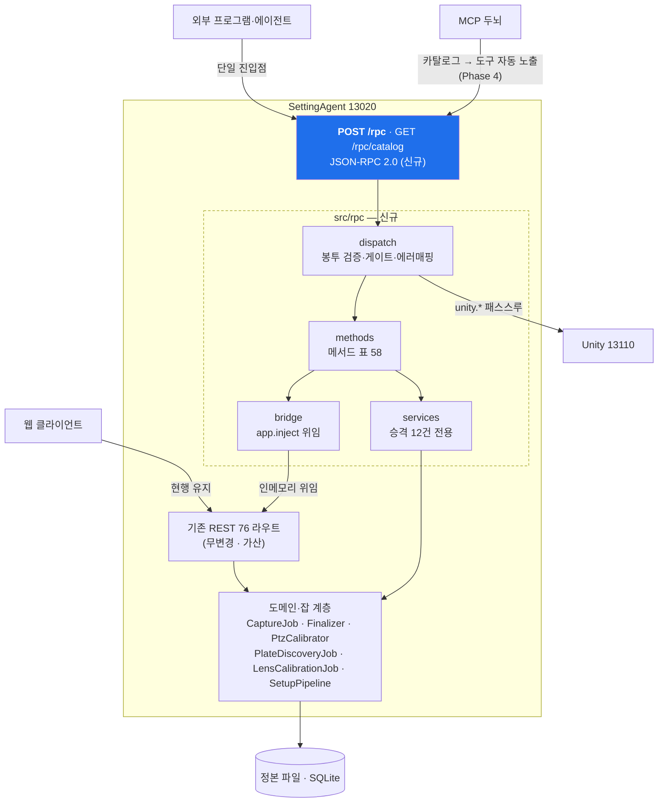

**핵심**: RPC 는 **로직을 갖지 않습니다**. 기존 라우트로 위임(`bridge`)하거나, REST 에 존재하지 않는 승격분만 `services` 로 신설합니다 → 두 번째 구현이 생기지 않습니다(설계서 P1).

---

## 3. 모듈 구성 · 의존 방향

```mermaid
flowchart TB
  subgraph NEW["src/rpc (신규)"]
    R_ROUTES["routes.ts<br/>registerRpcRoutes"]
    R_DISP["dispatch.ts<br/>순수 디스패치"]
    R_METH["methods.ts<br/>메서드 표(카탈로그 메타 포함)"]
    R_BR["bridge.ts<br/>inject 어댑터"]
    R_ERR["errors.ts<br/>코드·HTTP 매핑"]
    R_TYPE["types.ts"]
    subgraph R_SVC["services/ — 승격 전용"]
      S1["placeSpaces.ts<br/>단건 편집·정렬·align 적용"]
      S2["cameraPresets.ts<br/>camerapos CRUD·gotoPreset"]
      S3["platePick.ts<br/>클릭 최근접 번호판"]
      S4["mappingAuto.ts<br/>전역번호 자동부여"]
    end
  end

  subgraph EXIST["기존 (무변경)"]
    E_SRV["api/server.ts"]
    E_ROUTES["api/*Routes.ts"]
    E_PLACE["capture/placeRoi.ts"]
    E_CTRL["calibrate/controlMath.ts<br/>pickNearestPlate"]
    E_CAMPOS["setup/cameraposWriter.ts<br/>mapTargets.parseCameraViews"]
    E_CRPC["clients/CRpcClient.ts"]
  end

  E_SRV -->|"한 줄 추가(가산)"| R_ROUTES
  R_ROUTES --> R_DISP
  R_DISP --> R_METH
  R_DISP --> R_ERR
  R_METH --> R_BR
  R_METH --> R_SVC
  R_BR -->|"app.inject"| E_ROUTES
  R_DISP -->|"unity.*"| E_CRPC
  S1 --> E_PLACE
  S2 --> E_CAMPOS
  S3 --> E_CTRL
  R_METH --> R_TYPE

  style NEW fill:#0d1117,stroke:#1f6feb
```

> 의존은 **신규 → 기존** 한 방향뿐입니다. 기존 모듈은 `src/rpc` 를 import 하지 않습니다(`api/server.ts` 의 등록 한 줄 제외).

---

## 4. 호출 흐름

### 4-1. 브리지 경로 (Phase 1·2 — 메서드 대부분)

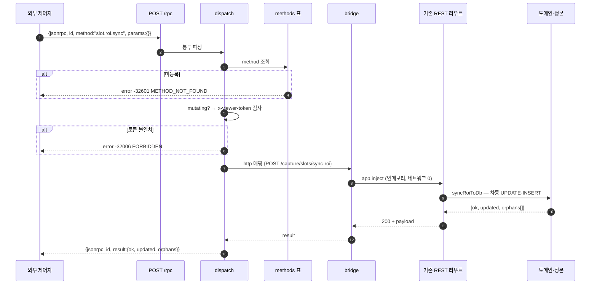

### 4-2. 승격 서비스 경로 (Phase 3 — REST 에 없던 기능)

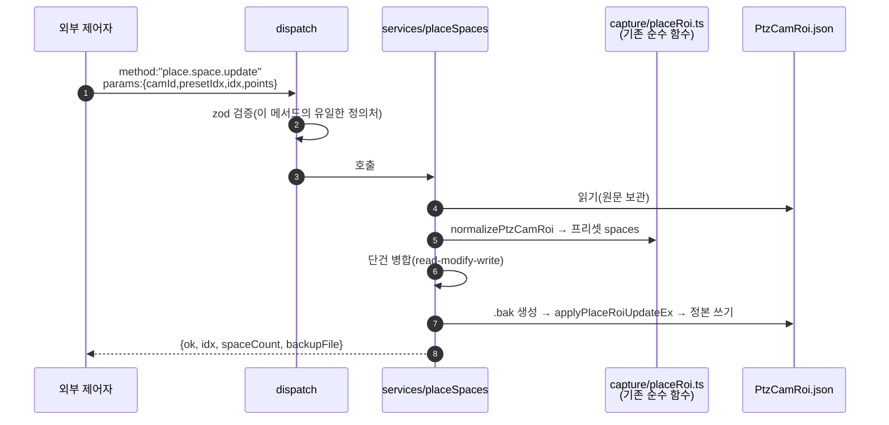

> **왜 승격이 필요한가**: 현행 `PUT /capture/place-roi` 는 프리셋을 **통째 교체**합니다. 외부 제어자가 전체 배열을 재구성하다 하나 빠뜨리면 주차면이 조용히 사라집니다(2026-07-28 8면→7면 실사고). 서버가 read-modify-write 를 소유해야 합니다.

### 4-3. 장기 잡 (센터라이징·수집·탐색·렌즈)

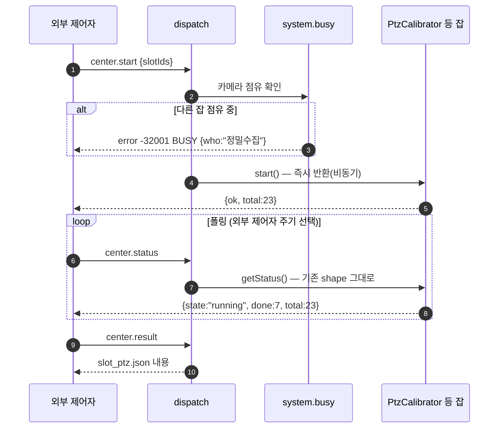

### 4-4. Unity 패스스루

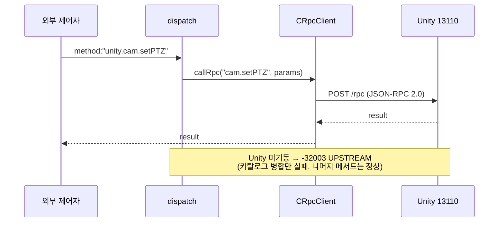

---

## 5. 오류 매핑 — HTTP 상태 → RPC 코드

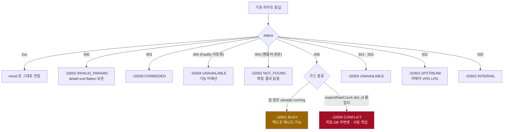

> **BUSY(-32001) 와 CONFLICT(-32005) 의 분리가 이 표의 핵심**입니다. 외부 제어자의 재시도 정책이 갈립니다 — BUSY 는 기다리면 풀리고, CONFLICT 는 기다려도 안 풀립니다.

---

## 6. 카메라 배타 · 잡 상태

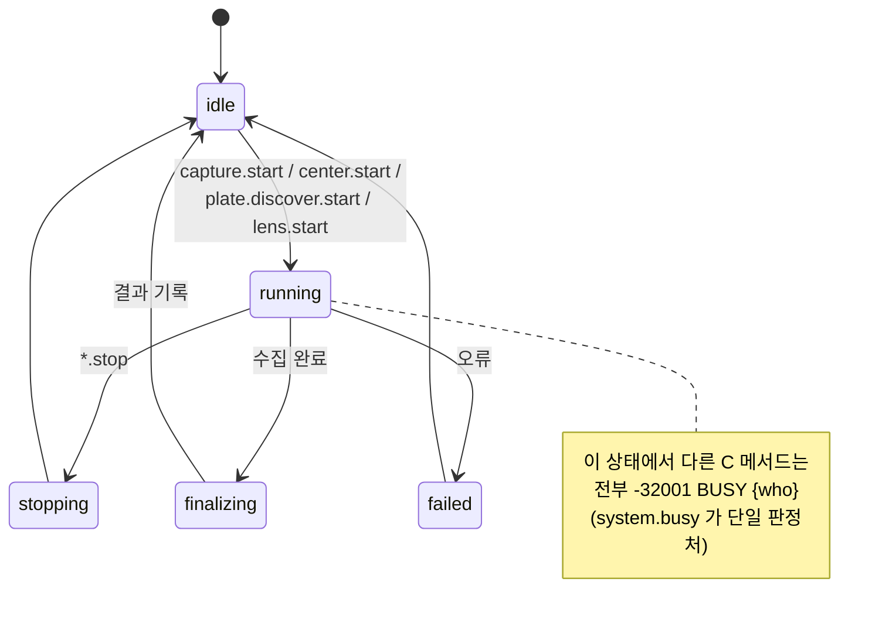

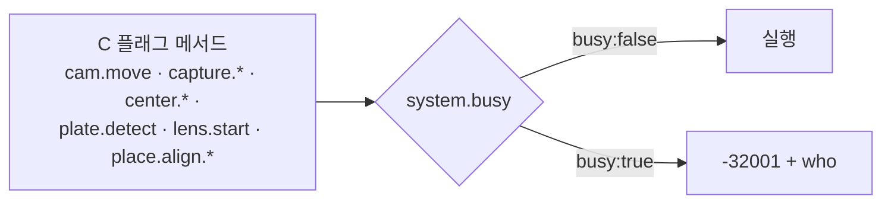

> 현재는 `lensCalib.isBusy` 클로저가 **렌즈 잡 시작에만** 이 판정을 합니다. RPC화에서 이를 **전역 `system.busy` 로 승격**해 모든 카메라 점유 메서드가 같은 판정을 공유합니다.

---

## 7. 정본 데이터 흐름 — 파괴 vs 비파괴

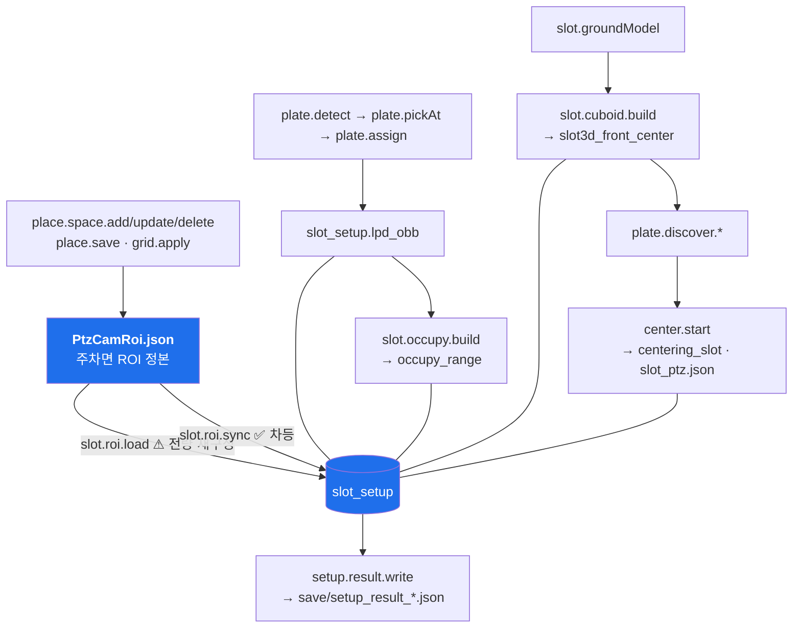

**실측 근거(라이브 대조)** — 같은 편집에서:

| 경로 | 센터링·vpd·점유 | 판정 |
|---|---|---|
| `slot.roi.load` (`replaceSlotSetup` DELETE+INSERT) | 23 → **0** | ⚠ 파괴적 — `confirm:true` 필수 |
| `slot.roi.sync` (차등 UPDATE·INSERT) | 23 → **23** | ✅ 외부 제어자 기본 경로 |

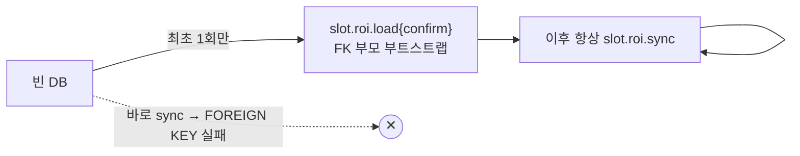

---

## 8. 파괴적 메서드의 안전 게이트

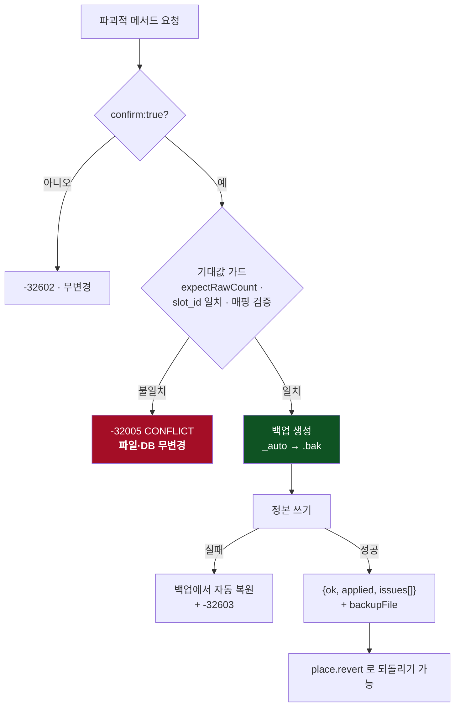

> 쓰기 순서 `_auto → .bak → 정본` 은 `groundGridRoutes.apply` 가 이미 쓰는 검증된 규약입니다. 승격 메서드도 **같은 규약**을 따릅니다(신규 규약 0).

---

## 9. 네임스페이스 → 정본 매핑

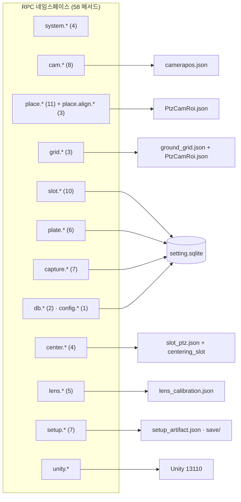

---

## 10. 헤드리스 완주 시나리오 (수용 테스트)

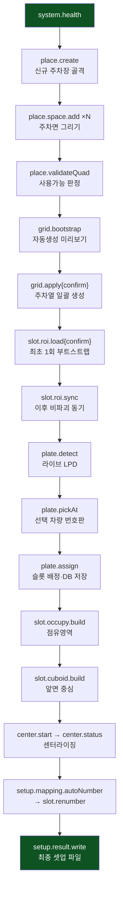

이 흐름 전체가 **브라우저 없이 RPC 호출만으로** 완주되면 목적 달성입니다.

---

## 11. 구현 단계 · 위험도

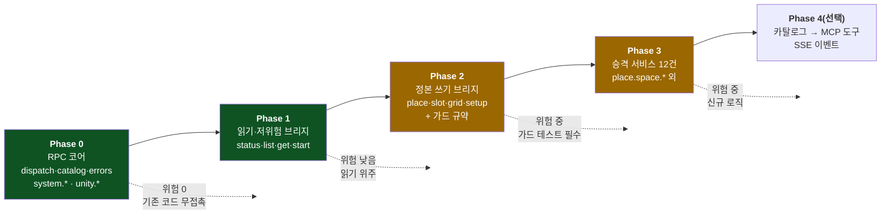

---

## 12. 제외 경계 — RPC 밖에 남는 것

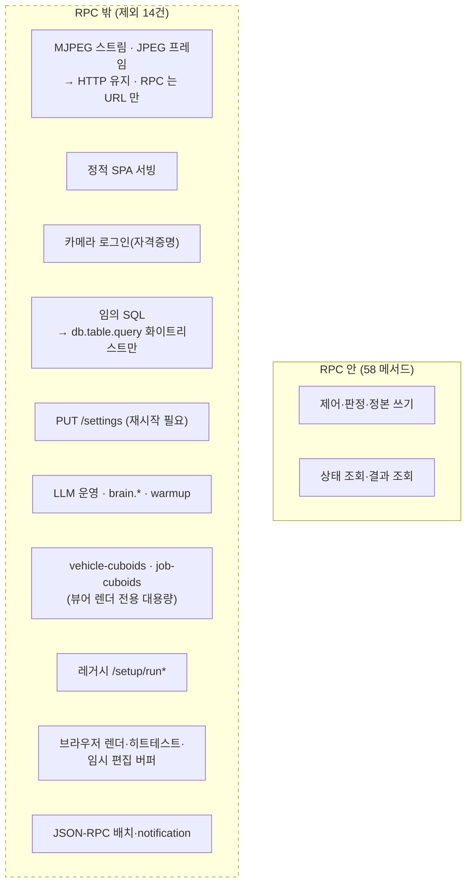

---

## 13. 착수 전 확정 사항

| 확정 | 내용 |
|---|---|
| 경로 | `POST /rpc` · `GET /rpc/catalog` (13020 루트). 기존 `/viewer/api/rpc`(Unity 프록시)는 **의미 불변** |
| 인증 | `viewer.controlToken` + `x-viewer-token` 재사용. 카탈로그의 `mutating` 이 게이트 대상의 단일 출처 |
| 위임 | Phase 1·2 는 `app.inject()` 브리지 — **기존 라우트 코드 이동 0** |
| 승격 | Phase 3 만 신규 서비스. REST 라우트는 추가하지 않음(RPC 전용 · 가산 최소) |
| 검증 | vitest — REST↔RPC 동등성 · 에러 매핑 · 가드 무변경 / 라이브 — 13020 기동 후 완주 시나리오 |
