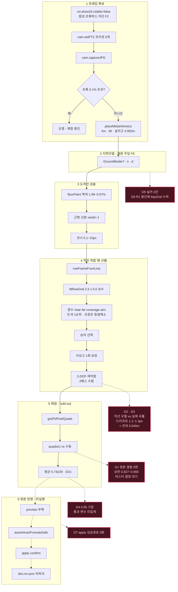
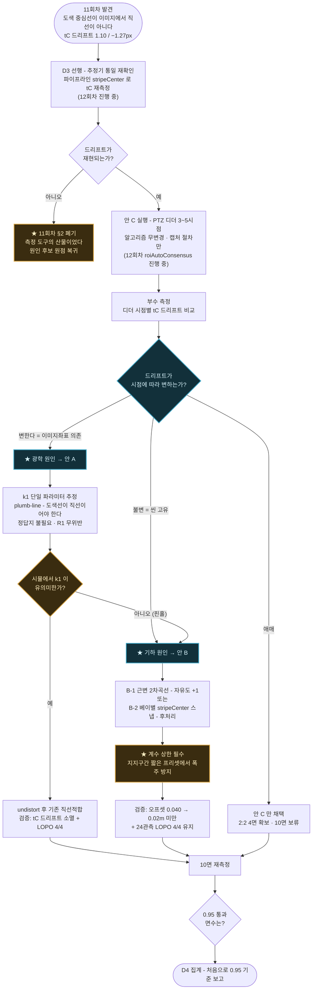

# 주차면 자동 생성 — 결손 분석 · 보정 방안 · 설계 플로우

- 최초 작성 2026-07-29 10:34 / **전면 개정 11:55** — 현자 라 (분석 세션 — **구현 세션과 별개**)
- 기준 시점: **11회차 종료**(`02k`, 11:44) + **12회차 진행 중**(`roiAutoConsensus.ts` 11:47 · `roiAutoStripe.ts` 11:49 신규/갱신, 보고서 `02l` 미작성)
- 범위: **분석·설계만.** 소스·정본·DB 무변경. 진행 중 세션의 `_workspace` 무접촉.

> **개정 사유:** 초판(10:34)은 6회차 스냅샷이었는데 세션이 80분 만에 11회차까지 갔다. 초판의 결손 G1·G2·G5 는 **전부 해소**됐고 원인 규명도 크게 진전했다. 낡은 내용(6회차 수치표·완료된 진단 절차·폐기된 지시문)을 **제거**하고, 현재 기준으로 다시 썼다.

---

## 1. 현황 (13회차 종료, 실측)

```
목표     : 면별 IoU ≥ 0.95   (0.98 에서 하향 — §5)
평균 IoU : 0.56883(단일시점) → 0.75668(다시점 합의 적용)
≥0.98    : 3 / 21면
≥0.95    : ★ 미집계 — 7~13회차 보고가 전부 0.98 기준이다 (§3-2 D4)
회귀     : 281파일 3552테스트 전량 green · tsc exit 0
```

| 프리셋 | 합의 IoU | 근변 오프셋 | 상태 |
|---|---|---|---|
| **1:1** (7면) | **0.97667** | 0.0800 → **0.0398m** | 6시점 **만장일치** — 합의가 무변화 |
| **2:1** (6면) | **0.96619** | 0.0563 → **0.0336m** | 6시점 **만장일치** — 합의가 무변화 |
| **2:2** (4면) | **0.94410** | — | **★ 12회차 다시점 합의로 0.00000 에서 해결** (득표 3/2/1) |
| **1:2** (4면) | 0.73858 | — | **정본 결함** — 수동이 5~12% 과대, 최대 IoU 0.827~0.900 |
| **1:3** (2면) | 검증불가 | — | **정본 결함** — 축 뒤바뀜. 모델 표현 범위 밖 |

**구조가 바뀌었다.** 21면은 이제 **①알고리즘 소관 잔여 3~5면** ②**정본 결함 6면**(알고리즘 무관) ③나머지 통과로 갈린다. "10면 정체"는 **목표 0.98 시절의 프레이밍**이며 0.95 기준으로는 낡았다(§8-1).

---

## 2. ★ 원인 규명 현황 — 후보 9종 배제, 1종 남음

10면 정체(0.93~0.977)에 대해 **실측으로 죽은 원인 후보**:

| # | 후보 | 반증 근거 | 라운드 |
|---|---|---|---|
| 1·2 | 깊이·폭 스케일 | 오차 −0.02% / −0.20% | 7 |
| 3 | 전단·회전(quad 자체) | 0.00° | 7 |
| 4 | 도색 스트라이프 **폭** | 반폭 13~22cm vs 관측 5.6~8.0cm 불일치 | 7 |
| 5 | 카메라 지상고 | 자가보정 4.95m 확정, 잔차 무관 | 4·8 |
| 6 | 재적합 **반복 부족** | 2패스에서 수렴(이동 0.0095px). **5패스가 바이트 동일** | 10 |
| 7 | 진동 | 감쇠 0.5 로 매끄럽게 수렴시켜도 IoU **하락** | 10 |
| 8 | 표본 밀도 비대칭 | 균등 가중 효과 0. **61표본 중 59 생존** — 불균형 자체가 없음 | 10 |
| 9 | 스트라이프 **규약**(중심 vs 모서리) | `r = −0.109 / −0.082` — 자동·수동 **둘 다 중심선** | 11 |

### ★ 남은 단 하나 — 실제 도색 중심선이 이미지에서 **직선이 아니다** (11회차)

같은 측정에서 나온 것. 자동 근변선 `L` 을 기준으로 면별 두 값을 쟀다 — `tC`(그 지점의 국소 도색 중심), `tM`(그 지점의 수동 근변).

| key | `tC` 행 방향 드리프트 | `tM` 드리프트 | **`tM − tC`** |
|---|---|---|---|
| **1:1** | −0.10 → +1.00 = **+1.10px** | +0.38 → +1.34 = +0.96px | **+0.501px** (범위 0.54) |
| **2:1** | +1.09 → −0.18 = **−1.27px** | +1.40 → +0.34 = −1.06px | **+0.498px** (범위 0.50) |

두 가지가 동시에 읽힌다.

1. **수동은 국소 도색 중심을 충실히 따라간다.** `tM − tC` 가 두 프리셋에서 **+0.501 / +0.498px 로 사실상 동일** — 일정한 미세 편의(≈1.9cm)일 뿐 규약 차이가 아니다.
2. **자동 「직선」이 국소 도색 중심을 못 따라간다.** `tC` 가 행을 따라 1.1~1.3px 드리프트한다. 그리고 **`tM` 이 같은 방향·같은 크기로 드리프트**한다 → **수동은 휘어 있는 실제 선을 따라갔고, 자동은 직선을 강제했다.**

크기 대조:
```
일정 편의 0.50px(0.019m) + 끝단 드리프트 ±0.55~0.64px(±0.021~0.024m) = 0.040~0.043m
실측 잔여 오프셋            : 1:1 0.0398m / 2:1 0.0336m      ← 자릿수·크기 일치
```

> **8회차부터 「회전 과보정」이라 부른 것의 정체가 이것이다 — 회전이 아니라 「직선 모델과 실제 곡률의 불일치」다.**

**단, 아직 「확정」이 아니라 「유력 후보」다.** 이 측정의 중심 추정기(±22px 프로파일 + 밝기가중)가 재적합 내부의 `stripeCenter` 와 **다른 구현**이다. 신호로 삼은 것은 드리프트 **추세**이고 `tM` 이 같은 추세를 보이는 것이 교차 근거지만, **추정기를 통일한 재확인이 안 됐다**(11회차 U1 → 12회차 표적).

---

## 3. 객관적 결손 체크 (11:55 기준)

### 3-1. 해소된 것 — 초판 결손 중 3건

| 결손 | 초판 판정 | **현재** |
|---|---|---|
| **G2** 잔차 벡터 진단 | 1순위·미착수 | **해소(7회차).** `roiAutoResidual.ts` 로 성분 분해 → 근변 오프셋 1자유도로 특정. 8회차 2-DOF 재적합으로 0.080→0.040m, **≥0.98 최초 3면 돌파** |
| **G1** 표본 확대 | 3순위·미착수 | **해소(9회차).** PTZ 지터 **24관측**, LOPO 4/4 폴드 통과. `aimCenterWeight` 등급 「과적합 의심」→**「검증됨」**(시뮬 한정) |
| **G5** 오버레이 구 경로 | 미해소 | **해소(7회차).** `roiAutoOverlay.ts:20` 이 `detectBaysWithModel` 을 import. **handoff U11 표기가 낡았다**(코드로 확인) |

### 3-2. 남은 결손

| # | 결손 | 근거 | 시급도 |
|---|---|---|---|
| **D1** | **정본 결함 6면 — 마스터 결정 미결** | `1:2` 4면 최대 IoU 0.827~0.900 · `1:3` 2면 축 뒤바뀜. **임계와 무관하게 미달 확정** | **최고 — 블로커** |
| **D2** | **비직선성 원인 미판별** | 렌즈왜곡인가 씬 도색인가. **어느 쪽이냐에 따라 보정안이 완전히 다르다**(§4) | **최고** |
| **D3** | **진단 추정기 ≠ 파이프라인 추정기** | 11회차 §2 자기 주의. **12회차가 지금 확인 중** | 높음 |
| **D4** | **0.95 기준 통과 면수를 아무도 안 셌다** | 목표를 0.95 로 바꿨는데 7~11회차 보고가 전부 **`≥0.98` 기준**이다. `1:1` 0.97667·`2:1` 0.96619 는 **평균**이며, 8회차가 "한쪽 끝만 0.98 초과, 반대쪽은 0.968/0.948" 이라 했으므로 **0.95 미달 면이 남아 있을 수 있다** | **높음 — 한 줄 집계** |
| **D5** | **실카(RTSP) 검증 0건** | 프로젝트 전체 0건. 24관측 LOPO 도 **전부 시뮬**. `aimCenterWeight`「검증됨」은 **시뮬 한정** | 높음 |
| **D6** | **R1 정적 봉인 구멍** | `test/roiAutoHoldout.test.ts:9` — `DETECT_MODULES = ['floorPaint.ts', 'bayGeometry.ts']`. **오늘 행 선별을 하는 `bayGrid.ts` 가 없다.** 글롭이 아니라 신규 모듈도 자동 봉인 안 됨 | 중 — **1줄 수정** |
| **D7** | `roi.auto.apply` 성공경로 0회 | 승인 대기. DB 고아행 `slot_id 24` 삭제 RPC 부재 | 중 |
| **D8** | G3 월드 통합 | 사정권 축소 후 보류(§6) | 낮음 |

### 3-3. ★ 프로세스 결손 — 기대값 높은 작업이 계속 밀린다

| 사례 | 이월 |
|---|---|
| LOPO 과적합 검증 | 6회차 지시 → **9회차에야 실행** |
| `2:2` 다시점 합의(P3) | 10회차 지시 → 11회차 미수행 → **12회차에 겨우 착수**(3라운드) |

두 건 모두 **기대값이 수치로 명확했는데**(2:2 는 0.944 실측이 이미 있었다) 예산이 P1 에 쏠려 밀렸다. 라운드마다 **예산의 일정 비율을 「기대값 확정된 미착수 건」에 선배정**하지 않으면 반복된다.

---

## 4. 보정 방안 3가지 — **12·13회차 실측 결과 반영**

> ### 결과 요약 (2026-07-29 12:05)
>
> | 안 | 결과 |
> |---|---|
> | **A** 렌즈왜곡 k1 | **시뮬에서 검증 불가**(핀홀이라 k1=0 이 당연 — "죽은" 것이 아니다). **실카 트랙의 선행 인프라로 보존.** 0.95 예산 3.37px 은 실카 주변부 왜곡이 단독으로 먹을 수 있는 크기다 |
> | **B** 근변 곡선화 | **보류 — 착수 금지.** 원인이 미확정인 채로 시뮬 곡률에 맞추면 실카에서 무너진다. 12회차 구현자도 승인 없이 멈췄고 그 판단이 옳았다 |
> | **C** PTZ 디더 다시점 | **★ 성공.** 12회차에 `2:2` **0.00000 → 0.94410**. `1:1`·`2:1` 은 6시점 만장일치라 **수치 완전 무변화**(하나 살리고 둘 깨지 않음). 13회차에 서비스 배선 완료(라이브 검증 미완) |
> | **판별(§4-4)** | **미수행** — 디더 시점별 드리프트 비교를 아직 안 했다. **비용 0 이므로 다음 라운드에 얹는다**(§12 P2) |
>
> **→ 안 C 를 「선별」에서 「좌표 융합」으로 확장하는 것이 현재 최우선 기술 수단이다(§8-3).** 아래 원문은 판단 근거로 남긴다.

§2 의 유력 후보(도색 중심선의 이미지상 비직선성)에 대한 보정안이다. **세 안은 서로 다른 계층에서 작동하며, 배타적이지 않다.**

### 안 A — 관측 모델 보정: **렌즈왜곡 1파라미터 역보정**

| | |
|---|---|
| **전제** | 비직선성의 원인이 **광학**이다(반경방향 왜곡) |
| **방법** | Brown-Conrady 반경왜곡 **k1 하나만** 추정해 픽셀을 undistort → 기존 직선 적합을 그대로 사용 |
| **추정법** | **정답지 불필요** — 여러 프리셋의 검출 도색선 스텁들이 *"직선이어야 한다"* 는 조건만으로 k1 최소제곱(plumb-line 캘리브레이션, 고전 기법). R1 무위반 |
| **자유도** | **+1** (전 프리셋·전 행 공유) |
| **장점** | 원인이 맞으면 **근본 해결**. 자유도 1이라 과적합 위험이 낮고 LOPO 로 바로 검증 가능. **실카에서는 어차피 반드시 필요**(D5·D6 선행 해소). `lens_calibration.json` 이라는 자리도 이미 있다 |
| **단점** | 원인이 광학이 **아니면 완전 무효**. 유니티 기본 카메라는 핀홀이라 **시뮬에서 k1≈0 이 나올 가능성이 높다** |
| **성공 판정** | k1 적용 후 `tC` 드리프트(1.1~1.3px)가 **사라지는가** |

> **★ 이 안의 진짜 값어치는 판별력이다.** 시뮬에서 k1 이 유의미하게 안 나오면 **"원인은 광학이 아니다"가 즉시 확정**되고 안 B 로 좁혀진다. 실패해도 정보를 남긴다.

### 안 B — 기하 모델 보정: **근변 곡선화 / 국소 스냅**

| | |
|---|---|
| **전제** | 원인 불문. **관측된 드리프트만** 사용 |
| **방법 B-1** | 근변을 직선 대신 **2차 곡선**으로 — 행 파라미터 `t` 에 대한 법선 오프셋 `δ(t) = a·t² + b·t + c`. **자유도 +1**(2차항만 추가) |
| **방법 B-2** | 더 보수적 — 격자 각 베이의 근변 코너를 **그 지점의 `stripeCenter` 로 스냅**. 모델을 안 바꾸고 후처리로 흡수 |
| **자유도** | B-1 프리셋당 +1 / B-2 사실상 0(데이터 종속) |
| **장점** | **원인을 몰라도 작동한다.** 드리프트를 직접 흡수하므로 즉효. 24관측 LOPO 인프라로 바로 등급 판정 가능 |
| **단점** | **"도색은 직선"이라는 물리 전제를 버린다** — 곡선이 잡음에 맞춰질 위험. B-1 은 지지구간이 짧은 프리셋에서 2차항이 폭주할 수 있어 **계수 상한이 필수**. 왜 휘었는지 모른 채 맞추므로 **실카 일반화가 불확실** |
| **성공 판정** | 근변 오프셋 0.0398/0.0336 → **<0.02m**, 그리고 LOPO 4/4 유지 |

> 11회차 구현자도 *"직선 도색이라는 물리 전제를 버리는 것이므로 신중해야"* 라고 경고했다. **A 를 먼저 시험하고 A 가 죽었을 때 B 로 가는 순서**가 옳다.

### 안 C — 관측 다중화: **PTZ 디더 + 다시점 합의**

| | |
|---|---|
| **전제** | 단일 시점의 계통오차는 **시점을 흔들면 부분 상쇄**된다 |
| **방법** | 캡처 시 pan/tilt 를 ±1~2° 디더해 **3~5시점** 캡처 → 각 시점 독립 검출 → 행 좌표로 정렬해 **중앙값 합의**. **프리셋 정의 무접촉** |
| **근거** | 9회차 실측 — `2:2` 가 pan −1.5°에서 **0.9440**, tilt −0.8°에서 **0.9521**(기저 0.0000) |
| **장점** | **알고리즘 변경 0 — 캡처 절차만.** `2:2` 4면에 실측 근거가 이미 있다. 계통오차·잡음 양쪽에 작동. **실카에서도 그대로 성립**(오히려 실카에서 더 필요) |
| **단점** | 캡처 시간 3~5배. 씬 도색이 실제로 휜 것이면 **상쇄 안 된다**. PTZ 재현오차가 큰 실카에서는 디더 자체가 잡음원(F10) |
| **성공 판정** | `2:2` 0.0000 탈출 + 10면의 근변 오프셋 감소 여부 |

> **12회차가 지금 이것을 하고 있다**(`roiAutoConsensus.ts`, 11:47).

### ★ 4-4. 세 안의 판별 — C 를 돌리면 A/B 가 공짜로 갈린다

디더는 도색선을 **이미지의 다른 위치**로 옮긴다. 따라서:

| 디더 시 `tC` 드리프트가 | 의미 | 채택 |
|---|---|---|
| **변한다** | 왜곡량이 이미지 좌표에 의존 = **광학 원인** | **안 A** (+ C 는 견고화로 병용) |
| **불변** | 씬의 도색 자체가 휘어 있음 | **안 B** (+ C 는 `2:2` 용으로만) |
| 측정 불가/애매 | 원인 미확정 | **안 C 만** 채택하고 10면은 보류 |

**즉 12회차 결과에 `tC` 드리프트 재측정을 얹기만 하면 A/B 결정이 난다.** 별도 라운드가 필요 없다.

### 4-5. 세 안 비교표

| | 안 A 왜곡보정 | 안 B 곡선화 | 안 C 다시점 |
|---|---|---|---|
| 작동 계층 | 관측 모델 | 기하 모델 | 캡처 절차 |
| 사정권 | 10면 | 10면 | **4면 확실 + 10면 가능** |
| 자유도 증가 | +1 (전역) | +1/프리셋 (B-1) | 0 |
| 알고리즘 변경 | 중 | 중 | **0** |
| 원인 가정 필요 | **예**(광학) | 아니오 | 아니오 |
| 실카 일반화 | **강함**(필수 인프라) | 약함 | **강함** |
| 실패 시 잔존 가치 | **판별 정보** | 없음 | 견고화는 남음 |
| R1 위반 | 없음 | 없음 | 없음 |
| 과적합 위험 | 낮음 | **중~높음**(상한 필수) | 낮음 |

**권고 순서: C(진행 중) → 그 결과로 A/B 판별 → A 우선 시험 → A 죽으면 B.**
B 를 먼저 하면 "왜 휘었는지 모른 채 맞춘" 모델이 남고, 실카에서 다시 무너진다.

---

## 5. 목표 기준 (0.95) 과 정본 결함

### 5-1. 목표 = 면별 IoU ≥ **0.95** (2026-07-29 마스터 결정, 잠정)

종전 0.98 은 **정답지 정밀도를 재지 않은 채** 세운 기준이었다. 경계 평행이동 오차 환산(`δ = L(1−IoU)/(1+IoU)`):

| IoU | 폭 2.5m | 깊이 5.0m |
|---|---|---|
| 0.98 | **2.5cm** | 5.1cm |
| **0.95** | **6.4cm** | 12.8cm |
| 0.90 | 13.2cm | 26.3cm |

0.95 는 자유통과가 아니다 — 면별 IoU 분포에 **0.8555~0.9301 구간이 비어** 있어 0.86~0.93 은 전부 동일 결과지만, 0.95 는 그 절벽 **위**에 있다.

**⚠ D4 — 그런데 0.95 기준 통과 면수를 아무도 세지 않았다.** 7~11회차 보고가 전부 `≥0.98` 기준이다. **집계 한 줄이면 되고, 이것 없이는 "지금 몇 면 남았는가"를 답할 수 없다.**

### 5-2. ★ 6면은 임계와 무관하게 미달 확정 — 마스터 결정 필요 (D1)

8회차 실측 치수로 `IoU_max = 자동면적 / 수동면적`:

| 면 | 수동 실측 | 수동 면적 | **도달 가능 최대 IoU** |
|---|---|---|---|
| s8 | 2.809 × 5.380 | 15.112 | **0.827** |
| s9·s10·s11 | 2.635 × 5.271 | 13.889 | **0.900** |

자동은 정확히 2.500 × 5.000 이다. `1:2` 4면 평균 상한 **≈0.882** — **알고리즘이 완벽해도 0.90 을 못 넘는 면이 있다.** `1:3` 2면은 축이 뒤바뀌어 모델 표현 범위 밖이다. (반면 `1:1` 2.500/5.001 · `2:1` 2.505/5.010 수동은 정확하다.)

| 선택지 | 내용 | 결과 |
|---|---|---|
| **A. 정본 수정** | 6면을 도색선 기준으로 재작성 | 채점 대상 복귀. 정본 쓰기·백업 절차 필요 |
| **B. 채점 제외** | `graded:false` 강등 + 사유 명시 | 유효 15면. 정직하나 커버리지 감소 |
| **C. 현행 유지** | 미달로 계속 계상 | 평균 IoU 가 영구히 눌리고 **개선 신호가 오염된다** |

**이 결정 전까지 6면의 "미달"은 알고리즘 탓인지 자 탓인지 귀속 불가**하다. 현재 최대 블로커.

---

## 6. G3(월드 통합) 판정 — 증분이나 **보류**

**재설계 아니다.** `src/ground/groundFrame.ts` 가 이미 존재하고(*"프리셋 불변 지면 2D 좌표계 — L3 의 유일한 신규 수학"*), `groundFrameOf(model, panDeg)` 가 프로덕션에서 돈다. 검출·격자적합·채점은 **재사용 100%**, 실질 변경은 `detectBaysWithModel` 선별부 한 곳 + `roiAuto.ts` 2패스화뿐이다. F5~F9 전부 유효.

**그러나 효용이 무너졌다:**

| 제약 | 판정 |
|---|---|
| 행 방위 일관성 | **무력** — `2:2` 의 오답은 **뒷행**이고 앞뒤 행은 **평행**하다 |
| 광축-지면 교점 | **`aimCenterWeight` 와 정보량 동일** — `project.ts:39` 에서 주점 = 이미지 중심이라 광축 교점 재투영이 `(imgW/2, imgH/2)` = `bayGrid.ts:325` 의 그 점. 게다가 그 항은 9회차에 「검증됨」이 됐다 |
| **행 배타 점유** | 유일 생존. 단 물리 법칙이 아니라 **운영 관행 가정** |

사정권도 8면 → 4면(`1:2` 는 정본 결함이라 G3 대상이 아님)이고, 그 4면은 **안 C 가 더 싸다**.

- **반증 실험(반나절, 회귀 0):** "`2:2` 가 고른 뒷행이 `2:1` 이 차지한 그 행인가?" 다르면 배타성이 무력 → G3 폐기.
- **G3b(카메라 간 통합)는 짓지 마라** — 실카에 설치좌표 공급원이 없다(`lens_calibration.json`·`camerapos.json` 어디에도 위치 없음). **R10 위반.** 반면 **G3a(카메라 내부)는 Δpan 만 필요**하고 pan 은 `camerapos.json` 에 실재하며 `roiAuto.ts` 가 이미 `Target.ptz.pan` 을 로드한다(기하에만 안 흘림).

---

## 7. 플로우차트

### 7-1. 현행 파이프라인 + 현재 결손 위치



### 7-2. 보정 방안 A/B/C 판별 흐름



---

## 8. ★ 방향 전환 (2026-07-29 12:05) — 원인 탐색 중단, 집계 → 융합 → 결정

### 8-1. "10면 정체"는 목표 0.98 시절의 낡은 프레이밍이다

목표가 0.95 로 내려온 순간 문제의 크기가 바뀌었는데, **7~13회차가 계속 0.98 프레임으로 달렸다.** 8회차 끝단 실측으로 보간하면:

| 프리셋 | 추정 통과 | 근거 |
|---|---|---|
| **1:1** | **7/7** | 최저면 ≈0.968. 검산 `(0.9854+0.968)/2 = 0.9767` = 보고 평균 **0.97667 과 소수 4자리 일치** |
| **2:1** | **5/6** | 유일 미달 s14 ≈ 0.948 — **문턱까지 0.002**. 검산 `(0.948+0.9843)/2 = 0.96615` ≈ 0.96619 |
| 2:2 | 0~2/4 | **면별 미보고 — 진짜 불확실** |
| 1:2·1:3 | 0/6 | 정본 결함, 알고리즘 무관 |

**추정 12~14 / 21.** ⚠ **보간 추정이며 실측이 아니다** — 양끝 실측 + 평균 검산 일치가 뒷받침할 뿐이다. **§12 P1 집계가 이를 대체해야 한다.**

**알고리즘이 풀어야 할 잔여: s14(+0.13px) + 2:2 2~4면(+0.4px) = 3~5면.**

### 8-2. 오차 예산이 방향 전환을 정당화한다

`δ = L(1−IoU)/(1+IoU)`, 깊이 L=5.0m, 환산 1px ≈ 0.038m(11회차 실측 `0.50px ≈ 0.019m`):

| 기준 | δ 허용 | px 환산 | **계통 드리프트 1.2~1.5px** | 캡처 잡음 0.25~0.34px |
|---|---|---|---|---|
| 0.98 | 0.0505m | **1.33px** | **90~113% — 예산 전체** | 19~26% |
| **0.95** | 0.1282m | **3.37px** | **36~44%** | 7~10% |

> **0.98 에서는 드리프트 원인 제거가 필수 관문이었다. 0.95 에서는 계통오차+잡음을 다 더해도 예산의 절반 이하다.** 13라운드가 판 "원인"은 더 이상 관문이 아니다. → **미해명인 채로 남긴다.** 목표가 0.98 로 복귀하면 다중 캡처 기준선 위에서 재개한다.

### 8-3. ★ 합의가 좌표를 버리고 있다 (코드로 확인)

```
src/tools/roiAutoConsensus.ts:154    const rep = views[Math.min(...win.members)]
src/rpc/services/roiAuto.ts:284-286  const winIdx = Math.min(...clusters[0].members)
```

6시점 다수결로 **어느 행인가만** 정하고, 최종 quad 는 **대표 시점 1장**의 좌표를 쓴다. **승리 군집 나머지 멤버의 지면좌표는 계산해 놓고 버린다.**

`1:1`·`2:1` 은 이미 **6시점 만장일치**라 6장이 그대로 있다. 코너별 **중앙값**으로 융합하면 잡음이 √N 감소(0.25~0.34 → 0.10~0.14px)하고, **필요한 것이 0.13px·0.4px 이므로 정확히 사정권**이다. **추가 캡처 0.**

### 8-4. 원인 규명은 중단 — 판별력 자체가 의심된다

12종이 죽었고 남은 1종(지면 비평면)도 약하다(`offsetPos.y=0.0`). 더 결정적으로 **캡처 잡음이 신호의 20~28%라 단일 캡처 기반의 다음 반증 실험은 판별력이 없다.** 잡음 바닥을 먼저 낮춰야 하는데 그 비용으로 얻는 정보가 0.95 목표엔 불필요하다.

> 미해명 서명 하나만 기록해 둔다(**추적 대상이 아니라 정황**): 캡처마다 드리프트와 자가보정 지상고가 **함께** 흔들리는 것은 렌더러의 프레임별 서브픽셀 변동(AA/샘플링)과 부합한다. 13번째 사냥감이 아니라, **원인이 무엇이든 다중 관측 평균이 작동한다**는 근거로만 쓴다.

---

## 9. 우선순위

| 순위 | 작업 | 사정권 | 비용 | 성공/실패 판정 |
|---|---|---|---|---|
| **1** | **0.95 기준 면별 IoU 집계**(D4) | 전체 | **벤치 1회** | 표가 나오면 성공. **측정이므로 실패 없음.** 모든 판단이 여기 의존 |
| **2** | **합의를 좌표 융합으로 확장**(§8-3) | **3~5면** | 수십 줄 | s14 ≥0.95 AND 2:2 면별 ≥0.95 AND **만장일치 프리셋 변화 ±0.002 이내** |
| **3** | **정본 결함 6면 결정**(D1) | **6면** | 판단만 | 유효 15면 기준 평균 재보고. **C(현행 유지) 기각 권고** |
| **4** | **R1 봉인 1줄 수정**(D6) | — | **1줄** | `DETECT_MODULES` 에 `bayGrid.ts` 추가 후 green |
| 5 | 합의 서비스 라이브 재측정 | — | 소 | **서버 재시작 승인 필요**(13회차 U1) |
| 6 | 실카 전환(D5) | 전체 | 대 | R10 해소. **안 A(k1)를 여기서 되살린다** |
| 7 | `roi.auto.apply` 종단(D7) | — | 소 | 승인 대기 |
| — | **드리프트 원인 탐색** | — | — | **중단**(§8-4). 0.98 복귀 시 재개 |
| — | **근변 곡선화(안 B)** | — | — | **착수 금지** — 원인 미확정. 실카에서 무너진다 |
| — | **G3b** 카메라 간 통합 | — | — | **짓지 마라**(R10 — 실카 설치좌표 공급원 없음) |
| — | 반증 12종 재시도 | — | — | **금지** |

**프로세스:** 라운드 예산의 일정 비율을 **「기대값이 수치로 확정된 미착수 건」에 선배정**하라(§3-3). 12회차가 이 방식으로 3라운드 이월된 다시점 합의를 25% 선배정해 **`2:2` 를 해결**했다 — 방식이 실증됐다.

---

## 10. ~~14회차 지시서~~ — **★ 실행 완료 · 결과로 대체됨 (2026-07-29 14:45)**

> **이 지시서를 다시 붙여넣지 마라.** 14회차에 실행됐고 결과가 나왔다:
> - **P1 집계 완료** — 골든 세트 기준 **13/21**. 단 §8-1 의 보간 추정은 **프리셋별로 크게 틀렸다**(`2:1` 5/6 추정 → **실제 1/6**, `1:2` 0/4 추정 → **실제 3/4**). 총계만 우연히 맞았다
> - **P2 좌표 융합 실패** — 성공기준 3개 전부 미달, 전체 13면 → **10면 감소**. 서비스 미탑재. **§8-3 의 "√N 잡음 감소" 근거가 틀렸다** — 융합은 잡음이 아니라 **시점별 계통 차이**를 평균한다
> - **P3-① `1:2` 채점 제외 권고는 반박됨** — 지상고 자가보정이 격자 배율을 자유롭게 만들어 "상한 0.900" 이 구속력을 잃는다(실측 s11=**0.9825**). **제외 반대**로 입장 변경
> - **P3-② 서버 재시작 불필요** — nodemon 이 반영 중
> - **P4 봉인 완료** — `bayGrid.ts` 추가 + 메타 테스트 신설, green
>
> **★ 그리고 14회차가 측정 타당성 붕괴를 발견했다** — 프레임에 따라 ≥0.95 통과면수가 **±6면** 변한다. **§8 의 오차 예산 논증은 유효하나, §8-1 의 면수 추정과 §8-3 의 융합 처방은 폐기한다.**
>
> **→ 현행 방향과 15회차 지시서는 `docs/20260729_143345_주차면자동생성_14회차후_방향재점검.md` 를 보라.**

<details>
<summary>실행 완료된 원문 (펼치기)</summary>

```text
14회차 지시 — ★ 원인 탐색을 중단한다. 집계 → 융합 → 결정.
근거 문서: SettingAgent/docs/20260729_103421_주차면자동생성_결손분석_설계플로우.md §8

────────────────────────────────────────────────────────────
[0] 방향 전환 (마스터 결정)
────────────────────────────────────────────────────────────
  13라운드가 판 「드리프트 원인」은 목표 0.98 의 관문이었다. 목표가 0.95 인 지금은
  관문이 아니다.

  오차 예산  δ = L(1−IoU)/(1+IoU),  깊이 L=5.0m,  1px ≈ 0.038m
    0.98 → 허용 1.33px : 계통 드리프트 1.2~1.5px 가 예산의 90~113%  = 원인 제거 없이 불가
    0.95 → 허용 3.37px : 드리프트 36~44% + 캡처잡음 7~10%           = 도달권

  → 원인은 **미해명인 채로 남긴다**(정직 표기 유지). 지면 비평면 후보도 이번엔 파지 마라.
    목표가 0.98 로 복귀하면 다중 캡처 기준선 위에서 재개한다.

────────────────────────────────────────────────────────────
[P1] ★최우선★ 0.95 기준 면별 IoU 집계 — 측정만, 알고리즘 무변경
────────────────────────────────────────────────────────────
  7~13회차 보고가 전부 ≥0.98 기준이다. **0.95 기준 통과 면수를 아무도 세지 않았다.**

  산출할 것:
    - 21면 전부의 면별 IoU (합의 ON / OFF 양쪽)
    - ≥0.95 카운트 · ≥0.98 카운트 (프리셋별 + 전체)
    - ★ 2:2 4면의 면별 값 — 지금 평균 0.94410 만 있고 산포가 미보고다

  참고: 분석 세션의 보간 추정 (반드시 실측으로 대체하라)
    1:1  7/7 통과 추정 (최저면 ≈0.968)
    2:1  5/6 통과 추정 (유일 미달 s14 ≈ 0.948 — 문턱까지 0.002)
    2:2  0~2/4 (불확실)
    1:2·1:3  0/6 (정본 결함, 알고리즘 무관)
    → 합계 12~14/21. 이 표의 진위가 이번 라운드 첫 산출물이다.

  성공기준: 표가 나오면 성공. 측정이므로 실패 없음.
  ※ 이 표 없이는 P2 의 성패를 판정할 수 없다. 반드시 선행하라.

────────────────────────────────────────────────────────────
[P2] 다시점 합의를 「선별」에서 「좌표 융합」으로 확장
────────────────────────────────────────────────────────────
  현재 구조 (확인된 사실):
    src/tools/roiAutoConsensus.ts:154    const rep = views[Math.min(...win.members)]
    src/rpc/services/roiAuto.ts:284-286  const winIdx = Math.min(...clusters[0].members)
  → 6시점 다수결로 **어느 행인가만** 정하고, 최종 quad 는 **대표 시점 1장**의 좌표를 쓴다.
    승리 군집 나머지 멤버의 지면좌표는 계산해 놓고 버린다.

  변경:
    승리 군집 멤버들의 quad 를 베이별로 대응시켜 **코너별 중앙값**을 취하고,
    기저 시점으로 재투영해 최종 quad 로 삼는다.
      ※ 평균이 아니라 **중앙값** — 이상 시점 1장에 강건해야 한다
      ※ 추가 캡처 0 (이미 6시점을 찍고 있다)
      ※ 결정론 유지(R2) — 짝수 개면 낮은 인덱스 쪽으로 확정

  기대: 캡처 잡음 0.25~0.34px 이 √N 감소(만장일치 6시점 → 최대 2.4배, 0.10~0.14px).
        필요한 것이 s14 0.13px · 2:2 0.4px 이므로 사정권이다.

  성공기준 (셋 전부 충족):
    ① s14 ≥ 0.95
    ② 2:2 면별 전부 ≥ 0.95
    ③ ★ 만장일치 프리셋(1:1·2:1) 변화가 ±0.002 이내
  실패 처리:
    ③ 이 깨지면 융합을 **옵션 플래그로 강등**하고 선별-only 를 기본으로 유지하라.
    (하나 살리고 둘 깨는 것은 금지 — 12회차와 같은 조건)

  ★ 부수 산출 (비용 0, 반드시 함께 보고):
    같은 디더 데이터에서 **시점별 tC 드리프트**를 비교하라.
      시점에 따라 변한다 → 광학 원인 (이미지 좌표 의존)
      불변                → 씬 원인
    별도 라운드 없이 원인 판별이 딸려 나온다. 단 이것은 기록용이며,
    이번 라운드에 그 원인을 좇지는 마라([0] 참조).

  실카 주의 (설계 메모):
    디더 역변환이 PTZ 판독값(j.actual)을 신뢰한다. 실카 재현오차는 수~수십px(F10)이라
    군집 판정(2.0m)은 견디지만 **좌표 융합의 정밀도는 저하된다.**
    융합 가중을 재현오차에 연동할 여지를 설계에 남겨라(이번 구현 대상 아님).

────────────────────────────────────────────────────────────
[P3] 마스터 결정 대기 2건 — 실행하지 말고 보고만
────────────────────────────────────────────────────────────
  ① 정본 결함 6면
     1:2 4면 = 수동이 5~12% 과대 → 최대 IoU 0.827~0.900 (알고리즘 완벽해도 미달)
     1:3 2면 = 축 뒤바뀜 → 모델 표현 범위 밖
     권고: 즉시 graded:false 로 채점 제외 + 사유 명시. 정본 재작성은 별도 트랙.
           현행 유지는 매 라운드 평균을 눌러 개선 신호를 오염시킨다.
  ② 합의 서비스 라이브 재측정을 위한 **서버 재시작 승인** (13회차 U1)
     코드는 들어갔으나 실행 중 프로세스가 구버전이라 roi.auto.score 가 미등록이다.

────────────────────────────────────────────────────────────
[P4] R1 봉인 1줄 수정 (독립·즉시)
────────────────────────────────────────────────────────────
  test/roiAutoHoldout.test.ts:9
    const DETECT_MODULES = ['src/ground/floorPaint.ts', 'src/ground/bayGeometry.ts'];
  → 오늘 실제로 행 선별을 하는 src/ground/bayGrid.ts 가 목록에 없다. 추가하라.
    글롭이 아니라 신규 모듈도 자동 봉인되지 않는다 — 글롭화를 함께 검토하라.
  ※ 추가 후 green 이어야 한다. red 면 실제 hold-out 오염이므로 즉시 보고.

────────────────────────────────────────────────────────────
금지 (이번 라운드)
────────────────────────────────────────────────────────────
  - 드리프트 원인 탐색 재개 (지면 비평면 포함). 미해명으로 남긴다
  - 근변 직선 모델의 곡선화. 원인 미확정 상태에서 착수하면 실카에서 무너진다
  - 반증 12종 재시도 (handoff §4 + 10~13회차분)
  - 정본·DB 쓰기, roi.auto.apply 실행
  - 목표 임계를 0.95 미만으로 내리는 제안

────────────────────────────────────────────────────────────
성공 판정 — 수치 상승이 아니다
────────────────────────────────────────────────────────────
  ① 0.95 기준 면별 표가 나왔다
  ② 알고리즘 소관 잔여 면수가 확정됐다 (융합 성공 여부와 무관하게)
  ③ 만장일치 프리셋에 회귀가 없다
  ①③ 이면 수치가 안 올라도 성공이다.
```

</details>

---

## 11. 영향도 분석

| 대상 | 영향 |
|---|---|
| **진행 중 세션** | **없음.** 이 문서는 신규 파일 1개. `_workspace/*`·`src/*`·정본·DB 무접촉 |
| `src/ground/floorPaint.ts` | 안 A 채택 시 undistort 전처리 추가 / 안 B-2 채택 시 `stripeCenter` 노출 |
| `src/ground/bayGrid.ts` | 안 B-1 채택 시 근변 모델 확장(직선 → 2차). **D6 봉인 대상에 추가 필요** |
| `src/ground/cameraIntrinsics.ts` | 안 A 채택 시 `k1` 필드 + `lens_calibration.json` 판독 |
| 캡처 계층 | 안 C 채택 시 디더 루프. **프리셋 정의 무접촉** |
| 채점 · `quadIoU` | **세 안 모두 무변경**(R4) |
| 회귀 3552 green | 안 C 는 위험 0. 안 A·B 는 `bayGrid` 직접 유닛테스트가 없어 회귀는 안 깨지지만 **안전망도 없다** — 신규 케이스 필요 |
| R1 hold-out | 세 안 모두 카메라 사실·도색 픽셀만 사용. **단 D6 구멍은 선행 수정** |
| R7 소수점 5자리 | 안 A 의 `k1` 영속화 시 준수 |
| R10 | 안 A 는 실카 재검증 **필수**(시뮬 핀홀 ≠ 실카 왜곡). 안 C 는 실카에서 PTZ 재현오차가 새 잡음원 |

---

## 12. 마스터 보고 문장

> **10면 정체의 원인 후보가 9종 배제되고 1종만 남았습니다** — 실제 도색 중심선이 이미지에서 **직선이 아닙니다**. 행 끝에서 끝까지 1.1~1.3px 벗어나고, **수동은 그 휘어진 선을 따라갔는데 자동은 직선을 강제**했습니다. 크기(0.040~0.043m)가 잔여 오프셋(0.0336~0.0398m)과 맞습니다. 다만 측정 추정기가 파이프라인과 달라 **재확인이 관문**이고, 12회차가 지금 그것과 다시점 합의를 하고 있습니다.
>
> **보정안은 셋입니다** — ①렌즈왜곡 k1 역보정(원인이 광학일 때·실카에 어차피 필요) ②근변 곡선화(원인 불문·즉효지만 물리 전제를 버림) ③PTZ 디더 다시점(알고리즘 무변경·`2:2` 4면에 0.944 실측 근거). **③을 돌리면 ①/②가 공짜로 갈립니다** — 디더 시 드리프트가 변하면 광학, 안 변하면 씬입니다. 별도 라운드가 필요 없습니다.
>
> **다만 지금 최대 블로커는 알고리즘이 아니라 결정입니다.** `1:2` 4면·`1:3` 2면은 **정본(수동 주석)이 5~12% 과대하거나 축이 뒤바뀌어** 있어 알고리즘이 완벽해도 최대 IoU 가 0.827~0.900 입니다. **정본 수정 / 채점 제외 / 현행 유지** 중 결정이 필요하고, 그 전까지 이 6면의 "미달"은 알고리즘 탓인지 자 탓인지 귀속되지 않습니다.

---

## 13. 변경 이력

| 시각 | 변경 | 사유 |
|---|---|---|
| 2026-07-29 10:34 | 최초 작성 — 결손 G1~G7 + 플로우차트 6종 | 마스터 요청("메모 확인 후 부족한 것 + 설계 플로우차트") |
| 2026-07-29 10:5x | 목표 기준 0.98 → 0.95 결정 기록 + 7회차 지시문 | 마스터 결정 |
| 2026-07-29 11:45 | 10회차 실측 반영 · G3 재설계 여부 판정 · 지시문 폐기 | 문서가 낡았음이 드러남 |
| **2026-07-29 11:55** | **전면 개정** — 11회차 기준 재작성. 해소된 결손(G1·G2·G5) 및 폐기 지시문·6회차 수치표 **제거**, 결손을 D1~D8 로 재정의, **§4 보정 방안 3가지 신설**, 플로우차트를 현행 2종으로 교체 | 마스터 요청("한 번 더 판단 + 객관적 결손 체크 + 보정 방안 3가지 · 불필요 내용 제거") |
| **2026-07-29 12:05** | **★ §8 방향 전환 신설**(원인 탐색 중단 · 오차 예산 계산 · 합의가 좌표를 버린다는 코드 확인) · §1 을 13회차로 갱신 · §4 에 A/B/C 실측 결과 반영 · §9 우선순위 교체 · **§10 14회차 지시서 신설** | 마스터 요청("목표 도달 방향 — Fable 담당") + 12·13회차 결과(2:2 0.944 해결 · JPEG 반증 · 캡처 변동 발견) |
