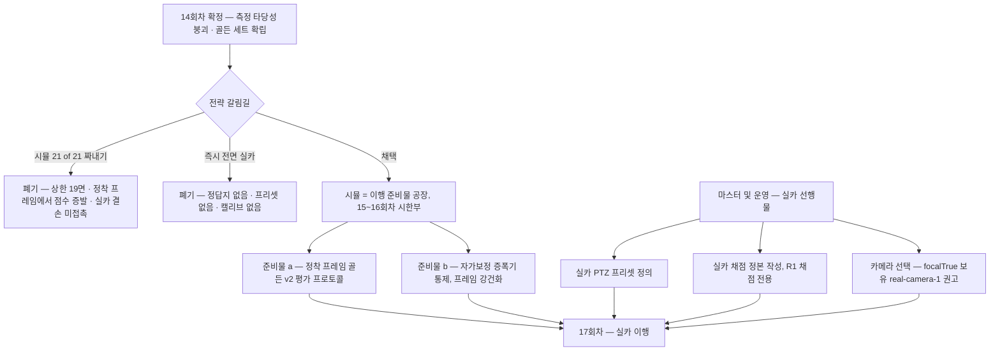

# 주차면 자동 생성 — 14회차 후 방향 재점검

- 작성: 2026-07-29 14:33 / 현자 라 (분석 세션 — 구현 세션과 별개)
- 기준 시점: **14회차 확정 결과**(`_workspace/02n_developer_changes_round14.md`, 13:54)
- **15회차 보고서는 아직 없다.** `_workspace` 최신이 `02n`(13:54)이고 작성 시점(14:33)까지 코드 활동도 없다. 이 문서는 14회차 확정 결과만으로 판단한다.
- 범위: **분석·설계만.** 소스·정본·DB·`_workspace` 무변경. 이 문서 1개 파일만 생성.
- 표기 규약: 근거를 **[코드]**(직접 확인) / **[문서]**(보고서에서 읽음) / **[추정]**(내 계산·추론)으로 구분한다. 14회차가 보간 추정의 위험을 실증했으므로 이 구분을 지킨다.

---

## 0. 판정 (결론 먼저)

> **① 시뮬에서 13/21 → 21/21 을 짜내는 트랙을 종료한다.** "21면 개별 ≥0.95"는 현재 정의상 도달 불가(`1:3` 2면이 `graded:false` → 상한 19면 **[문서]**)이고, 현재 성적은 "이동 직후 프레임" 프로토콜에 얹혀 있으며 실카(정착 프레임)로는 **하락 방향의 실측 증거**가 있다(T1 **[문서]**). 여기서 더 짜낸 점수는 이행 시 상당 부분 증발한다.
>
> **② 방향은 실카다. 단, 즉시 전면 이행은 불가능하다** — 실카에 PTZ 프리셋이 없고, 채점 정답지가 없고, 사용 중 카메라(`real-camera-2`)에 캘리브레이션이 없다(T3 **[문서]**). 이 셋은 전부 마스터/운영 선행물이라 알고리즘 라운드로 해결되지 않는다.
>
> **③ 따라서 시뮬은 딱 2라운드(15~16회차), "실카 이행 준비물 공장"으로만 쓴다.** 만들 준비물은 두 가지뿐이다:
> - **정착 프레임 기준 평가 프로토콜**(골든 세트 v2) — 실카가 찍는 것은 정착본이다. 평가 기준을 지금 실카 쪽으로 옮겨 놓는다.
> - **자가보정 증폭기 통제**(프레임 강건화) — 프레임 차이 ±6면의 주 증폭 경로로 지목된 미탐색 단서. 이것이 잡히면 측정 타당성 붕괴와 `2:1` 결손이 같이 풀릴 수 있다.
>
> 이 둘은 시뮬 점수용이 아니라 **실카에서 그대로 필요한 속성**이므로, 실카 선행물이 준비되는 동안의 시뮬 작업이 낭비가 되지 않는다. 병행이 아니다 — 시뮬 트랙의 목표 자체를 "점수"에서 "이행 준비물"로 바꾸고 시한을 못 박는 것이다.
>
> **④ 15회차 착수 전 선결: `selectedCameraId` 가 지금도 `"real-camera-2"` 다**(`config/tools.config.json:98` **[코드]**, 14:33 시점). 이 상태의 라이브 채점은 전부 무효다. 되돌리기 전에는 골든 세트 작업만 유효하다.

---

## 1. 14회차가 바꾼 것

### 1-1. 측정 타당성 붕괴 **[문서]**

같은 PTZ·같은 알고리즘에서 **어느 캡처 프레임이 잡혔느냐로 ≥0.95 통과면수가 ±6면** 변한다. 각 프레임은 재현 100%라 잡음이 아니라 결정론적 종속이다.

| 프리셋 | 프레임 | 평균 IoU | ≥0.95 |
|---|---|---|---|
| 1:1 | `65182cdfae62` | 0.85541 | 0/7 |
| 1:1 | `6006a034bfe2` | 0.97474 | 7/7 |
| 2:1 | `80cdf49cdecc`(이동직후) | 0.96614 | 4/6 |
| 2:1 | `e33628e921c2`(정착) | 0.85402 | 1/6 |

**함의:** 7~13회차의 라운드 간 향상(0.72496 → 0.74229 → 0.75668)이 알고리즘 개선인지 프레임 운인지 **구분 불가**. 그 라운드들의 프레임은 남아 있지 않다. 프레임 해시 없는 IoU 수치는 해석 불가로 간주한다.

### 1-2. 골든 세트 확립 **[코드]**

`test/fixtures/roiAutoGolden/` 30장(5프리셋 × 디더 6시점) + `manifest.json`(프레임별 sha256_12·PTZ·디더). `roiAutoFuse.ts` 는 인자 없이 실행하면 이 세트를 읽는다(`roiAutoFuse.ts:50-52`). **규약: 알고리즘 비교는 이 세트 위에서만. 라이브는 실환경 확인용.**

단, **이 세트는 "이동 직후" 프레임 위주다**(§4 참조 — 이것이 목표 재정의의 핵심 논점이다).

### 1-3. 현재 성적표 (골든 세트 · ③ 선별 tilt보정 = 현재 기본) **[문서]**

| 프리셋 | ≥0.95 | 평균 | 비고 |
|---|---|---|---|
| 1:1 | 7/7 | 0.97474 | 만장일치 |
| 1:2 | 3/4 | 0.95373 | s11=0.9825 — 현재 최상 프리셋 |
| 2:1 | **1/6** | 0.85402 | ★ 최대 결손 — 단 §5-2 교락 주의 |
| 2:2 | 2/4 | 0.94182 | tilt 보정으로 0 → 해결 |
| 1:3 | 0/2 | graded:false | 축 뒤바뀜 — 모델 표현 밖 |
| **전체** | **13/21** | 0.77644 | ≥0.98 은 1면 |

### 1-4. 그 외 확정 사항 **[문서]**

- 좌표 융합(④) 성공기준 3개 전부 실패 → 서비스 미탑재(13면 → 10면 감소). 구현은 `roiAutoFuse.ts` 에 보존.
- 12:46 `selectedCameraId` 가 `real-camera-2` 로 바뀌어 이후 라이브 채점 3건 무효 폐기. **지금도 그 상태다 [코드]**.
- 서버 재시작 문제 해소(13020 nodemon 반영). R1 봉인은 메타 테스트로 강화(`test/roiAutoHoldout.test.ts:81-90` **[코드]**).
- 회귀 281파일 3553테스트 green · tsc 0.

---

## 2. 폐기·정정된 판단 (은닉 없이)

직전 분석 문서(`docs/20260729_103421_...md` — 내가 썼다)의 권고 3건이 14회차 실측으로 어떻게 됐는지:

| # | 내 권고 | 결과 | 정정 |
|---|---|---|---|
| 1 | **좌표 융합**(§8-3, "잡음 √N 감소로 s14·2:2 사정권") | **실패.** 성공기준 3개 전부 미달, 전체 13면 → 10면 감소 **[문서]** | 근거가 틀렸다. **융합은 잡음이 아니라 시점별 계통 차이를 평균한다** — 시점별 자가보정 지상고가 4.956~5.121m 로 갈리고, 기저가 좋은 프리셋은 악화·나쁜 프리셋은 개선, 방향이 프리셋마다 반대. 나는 "캡처 잡음 0.25~0.34px"를 독립 잡음으로 취급했는데 실제로는 시점별 계통 편향이었다. **권고 철회** |
| 2 | **`1:2` 채점 제외**(§9 순위3, "상한 0.827~0.900이라 즉시 graded:false") | **반박됨.** 실측 s11=0.9825 가 "상한"을 초과 **[문서]** | 상한 계산은 격자가 2.5×5.0m 고정일 때만 성립하는데 **지상고 자가보정이 격자 배율을 자유롭게 만들어 상한이 구속력을 잃는다**. 구현자의 반대가 타당하다. **권고 철회 — 포함 유지로 입장 변경**(§6-1) |
| 3 | **0.95 통과 면수 보간 추정**(§8-1, "12~14/21") | 총계는 우연히 맞음(13). **프리셋 분포는 크게 틀림**: `2:1` 5/6 추정 → 실제 1/6, `1:2` 0/4 추정 → 실제 3/4 **[문서]** | 평균+양끝 실측으로 중간을 보간하는 방식은 분포가 한쪽으로 쏠린 경우(2:1 은 0.756~0.958 단조 산개) 완전히 어긋난다. **보간 추정을 판단 근거로 쓰는 관행 자체를 금지 목록에 올린다**(§9 지시서 금지 항목) |

추가로 정정할 것:

- 직전 문서 §8-2 "오차 예산상 0.95 는 도달권" 계산은 **프레임 종속을 모르는 상태의 계산**이었다. 프레임 차이 하나가 IoU 0.12(2:1 평균 기준)를 움직이는데, 이는 내가 잡은 "계통 드리프트 36~44%" 예산 밖의 항이다. 예산 논리는 **프레임이 고정된 조건에서만** 유효하다.
- 직전 문서 §8-4 "원인 탐색 중단" 판단 자체는 유지되나, 그 때 "미해명 서명"으로만 적어둔 **캡처 간 변동이 사실은 이번 판의 본체**(씬 비정지 + 자가보정 증폭)였다. 축소 평가였다.

---

## 3. 방향 판정과 근거 (전략적 갈림길)

### 3-1. 질문

> 시뮬에서 13/21 → 21/21 을 계속 짜내는 것이 옳은가, 아니면 지금 실카로 이행해 거기서 성립하는 설계를 잡는 것이 옳은가?

### 3-2. "시뮬 계속" 이 지는 이유

1. **목표가 정의상 도달 불가.** `1:3` 2면은 `graded:false`(D1_TOO_FEW_BAYS, 축 뒤바뀜) **[문서]** — 21/21 의 상한이 19면이다. 목표 문장 자체가 낡았다.
2. **점수가 이행 시 증발할 실측 증거.** 현행 수치는 "이동 직후 1장" 프로토콜 의존. 정착 프레임이면 `2:1` 0.966→0.854, `1:2` 0.954→0.759 **[문서]**. 실카는 정착본을 찍는다. 즉 시뮬에서 올린 점수의 일부는 **프로토콜 아티팩트**다.
3. **한계 효용 붕괴.** 7~13회차 향상분이 프레임 운과 구분 불가로 판명 — 같은 방식의 라운드를 더 도는 것의 기대 효과를 신뢰할 수 없다.
4. **실카 고유 결손이 시뮬에서 안 보인다.** paintMask 백색 차량 오염, 4~5줄 다중 행, 프리셋 부재 **[문서]** — 시뮬 21/21 을 찍어도 이 문제들은 하나도 건드려지지 않는다.

### 3-3. "지금 전면 실카" 가 지는 이유

1. **성공 척도가 없다.** 실카에 채점용 수동 정본이 없다. R1(수동 정본은 채점 전용) 구조상 정답지 없이는 goal/loop 가 수렴 판정을 못 한다 — 관찰형 루프가 "좋아 보인다"로 돌게 되고, 그것은 이 프로젝트가 15라운드 동안 배제해 온 방식이다.
2. **파이프라인이 구조적으로 안 돈다.** PTZ 프리셋이 `"현재 위치"` 1개 **[문서]** — 프리셋별 지면모델 주입 구조의 입력이 없다. `real-camera-2` 는 자체 캘리브 없음, `focalTrue` 는 `real-camera-1`(153)뿐 **[문서]**. U15 확정 사실(펌웨어 f 최대 7.7% 오차)상 캘리브 없는 카메라로는 f 주입 전환점(F5)이 무효가 된다.
3. 위 선행물(프리셋 정의·정답지 작성·카메라 선택)은 **전부 마스터/운영 결정**이라, 지금 "실카 라운드"를 선언해도 구현자가 첫 라운드에 할 수 있는 일이 없다.

### 3-4. 판정 — 목적지는 실카, 시뮬은 시한부 준비물 공장

**어정쩡한 병행이 아니다.** 시뮬 트랙의 **목표를 교체**하고 **시한을 박는다**:

- **시뮬 점수(≥0.95 통과면수)는 더 이상 목표가 아니다.** 회귀 감시선으로 강등한다(만장일치 프리셋 무회귀 ±0.002 등).
- 시뮬 15~16회차가 만드는 것은 실카에서 그대로 쓰이는 두 속성뿐:
  - **(a) 정착 프레임 평가 프로토콜** — 평가 기준을 실카가 보게 될 프레임으로 옮긴다. 이후 모든 개선은 실카 대표 조건에서 측정된다.
  - **(b) 프레임 강건화(자가보정 증폭기 통제)** — "어느 프레임이 잡혀도 같은 답"이라는 속성은 실카(노이즈·H.264·정착)에서 시뮬보다 더 필요하다.
- 같은 기간 마스터/운영이 실카 선행물 3종(§6-4)을 준비한다. 이건 병행 "개발"이 아니라 **결정·운영 작업**이라 라운드 예산과 경합하지 않는다.
- **17회차부터 실카.** 준비물이 늦어지면 시뮬 라운드를 늘리는 게 아니라 **쉰다** — 시뮬 점수 라운드로 회귀하는 것을 금지한다.

근거의 핵심: (a)(b)는 **시뮬↔실카 어느 쪽 미래에서도 가치가 소멸하지 않는 교집합**이고, 그 교집합이 마침 14회차가 지목한 최대 미탐색 단서(증폭기)와 일치한다. 반면 "시뮬 점수 +N면"은 실카 미래에서 가치가 증발하는 것이 실측으로 드러나 있다.



---

## 4. 목표 재정의

### 4-1. "21면 개별 ≥0.95" 는 더 이상 옳은 목표가 아니다

- 분모부터 틀렸다: `1:3` 2면 제외 시 **유효 19면**(1:2 포함 여부는 마스터 결정, §6-1).
- 조건도 틀렸다: "어느 프레임에서?"가 정의돼 있지 않다. 골든 v1(이동 직후 위주)은 실카를 대표하지 않는다.

### 4-2. 새 성공 정의 — 3층

| 층 | 정의 | 성공 기준 |
|---|---|---|
| **G1 평가 프로토콜** | **정착 프레임** 골든 세트 v2 위 채점을 정본 평가로 삼는다 | graded 면(19면 기준) **면별 IoU ≥0.95**. v1 은 회귀 감시용으로만 유지 |
| **G2 프레임 강건성** (신규 — 이것이 핵심) | 같은 PTZ 의 서로 다른 프레임(이동직후 vs 정착) 사이 결과 안정성 | 프리셋 **평균 IoU 격차 ≤0.02** (현재 `2:1` 0.112, `1:2` 0.195 **[문서]** → 목표 ≤0.02). 점수보다 이 값이 실카 전이를 예측한다 |
| **G3 실카** | 실카 정답지 확보 **후** 정의한다 | 그 전까지 실카 수치 목표를 세우지 않는다(R10). 잠정 마일스톤은 "실카 1프리셋에서 검출이 도는가"(정성) |

**G2 를 신설하는 이유:** 14회차의 교훈은 "점수가 높다"가 아니라 "프레임이 바뀌어도 점수가 같다"가 진짜 품질이라는 것이다. G1 만 있으면 또 특정 프레임에 과적합한다.

---

## 5. 다음 표적 우선순위

| 순위 | 표적 | 비용 | 기대효과 | 위험 | 수치 성공/실패 기준 |
|---|---|---|---|---|---|
| **0** | **`selectedCameraId` 상태 정리** (§6-3) | 결정+config 1줄 | 라이브 경로 유효성 회복 | 12:46 변경이 마스터 의도일 수 있음 — **확인 필수** | 복귀 후 라이브 `1:1` 채점이 골든 세트와 같은 자릿수(평균 0.8~1.0 대). 붕괴(0.0x)면 다른 원인 — 즉시 중단·보고 |
| **1** | **정착 프레임 골든 세트 v2 확립 + 현행 알고리즘 재채점** | 캡처 30장 + 벤치 1회 | G1 확립. 이후 모든 개선이 실카 대표 조건에서 측정됨 | 씬 간헐 변동(3분 9종 **[문서]**)으로 "정착" 판정이 수렴 안 할 수 있음 | 정착 판정 = **프레임 해시 연속 2회 동일**(상한 30초, 미수렴 시 최후 프레임 채택+기록). 산출 = v2 30장+manifest+면별 성적표. **측정이므로 실패 없음** |
| **2** | **자가보정 증폭기 통제 A/B/C** (14회차 권고 4 — 미탐색 최대 단서) | 도구 레벨 수십 줄 | G2 직행. `2:1` 결손·측정 붕괴가 같은 뿌리면 동시 해결 | CALIB=0 이 `1:1` 나쁜 프레임을 0.932 까지만 올림 **[문서]** — 단독으론 부족할 수 있음 | A=현행(시점별 자유보정) / B=`calibrateHeight:false`(F6 상수 4.950m — `bayGeometry.ts:195` 기본 true **[코드]**) / C=**6시점 지상고 중앙값 공유**(신규 — `roiAutoFuse.ts:387` 이 시점별 지상고를 이미 출력 **[코드]**). 성공 = ① `2:1` 두 프레임 평균격차 0.112→**≤0.02** ② 만장일치 프리셋 무회귀 **±0.002** ③ v2 ≥0.95 통과면수 **≥ A(현행)**. 실패 = B·C 모두 ①미달 → 증폭기 가설 기각 기록, 서비스 무변경 |
| **3** | **`2:1` 결손 재측정** — 순위 1·2 **이후** | 벤치만 | 진짜 결손 크기 확정 | 지금 파면 교락된 수치를 판다 | §5-2 참조. v2+승자 보정 위에서 `2:1` ≥0.95 면수 재집계. **1/6 이 유지되면** 그때가 알고리즘 결손이고 16회차 표적이 된다 |
| 4 | 실카 선행물 보고(설계만) | 문서 | 17회차 착수 조건 | 없음 | §6-4 목록의 각 항에 필요 결정·예상 작업량 명시. 실행 0건 |
| — | 시뮬 점수 튜닝 라운드 | — | — | — | **금지** — §3-4 |

### 5-2. `2:1`(1/6) 을 지금 직접 파지 않는 이유

`2:1` 의 1/6 은 세 요인이 교락돼 있다: ① 골든 v1 의 `2:1` 기저가 하필 **정착본**(`e33628e921c2`)인데 다른 프리셋 기저는 이동직후본 — 세트 안에서 프레임 조건이 균질하지 않다 **[문서·manifest 대조]** ② `CALIB=0` 에서 `2:1` 의 k1/k3 프레임 격차 0.115→0.0002 소멸 **[문서]** — 결손의 상당분이 증폭기 경유일 수 있음 ③ 진짜 알고리즘 결손. **①②를 먼저 통제하지 않으면 ③의 크기를 잴 수 없다.** 순위 1·2 가 곧 `2:1` 분석의 전처리다.

---

## 6. 마스터 결정 대기 건 + 내 권고

### 6-1. `1:2` 채점 제외 여부 (14회차 §5 ① — 구현자 반대, 마스터 대기)

**권고: 제외하지 않는다 (구현자 찬성 — 내 이전 권고를 철회한다).**
근거: 실측 s11=0.9825 가 "상한 0.900" 논리를 깼다. 상한은 격자 2.5×5.0m 고정 가정에서만 성립하는데 자가보정이 그 가정을 깬다 **[문서]**. `1:2` 는 현재 3/4 로 최상 프리셋이며, 제외는 통과면 3개를 지운다. 단, **수동 정본이 유니티 참값 대비 5~12% 과대라는 측정 자체는 여전히 유효**하다(F7 대조) — 장기적으로 `1:2` 정본 재작성 트랙은 남긴다(실카 이행보다 후순위).

### 6-2. 평가 기준 프레임 — 이동직후 vs 정착 (14회차 권고 3)

**권고: 정착 프레임을 정본 평가로 채택한다(골든 v2).**
근거: 실카는 정착본을 찍는다 **[문서]**. 이동직후본으로 평가하면 실카에서 재현되지 않는 점수를 최적화하게 된다. v1 은 폐기하지 않고 G2(프레임 강건성) 측정의 반쪽으로 유지한다.

### 6-3. `selectedCameraId` 복귀 (12:46 변경, 주체 미상)

**권고: 15~16회차 동안 시뮬(simulator 계열)로 복귀 승인.** 현재 값 `"real-camera-2"` **[코드]** 상태에서는 라이브 검증 경로가 전부 무효다. 단 12:46 변경이 마스터의 실카 정찰 의도였을 수 있으므로 **일방 복귀가 아니라 확인 후 복귀**여야 한다. 17회차 실카 이행 시에는 `real-camera-1`(focalTrue 보유) 로 전환 권고.

### 6-4. 실카 이행 선행물 3종 착수 (신규 — 이 문서의 제안)

**권고: 지금 착수를 승인하라.** ① **실카 PTZ 프리셋 정의**(운영 — 어느 주차 행을 몇 개 프리셋으로 볼 것인가) ② **실카 채점 정본 작성**(수동 ROI — R1 준수, 채점 전용. 이것 없이는 실카 goal/loop 가 성립 불가) ③ **카메라 확정**(`real-camera-1` 권고 — `focalTrue` 92/112 표본 보유, U15 의 7.7% 펌웨어 오차 회피). 부수 권고: 시뮬 씬에 **흰 차량 배치가 가능하다면** paintMask 오염을 시뮬에서 리허설할 수 있다(§8 불확실 — 가능 여부 미확인).

### 6-5. `roi.auto.apply` 성공경로 (T5 잔존)

**권고: 보류 유지.** 실카 이행 방향에서 시뮬 정본에 apply 를 실행할 실익이 낮고, 위험(정본 쓰기)만 있다. 실카 정본 체계가 서면 그 위에서 종단 검증한다.

### 6-6. `1:3` 정본(축 뒤바뀜) 재작성

**권고: 보류.** `graded:false` 로 이미 정직하게 처리돼 있고 **[문서]**, 시뮬 완성도용 재작성은 실카 우선 방향에서 후순위다.

---

## 7. 버릴 것 / 유지할 것

### 유지 (활성 — 예산 배정 대상)

| 대상 | 이유 |
|---|---|
| `test/fixtures/roiAutoGolden/` + v2(신설 예정) | 측정 기반. 유일한 회차 간 비교 수단 |
| `src/tools/roiAutoFuse.ts` | 골든 세트 표준 벤치. ①~④ 변형 + 시점별 드리프트·지상고까지 한 번에 출력 **[코드]** |
| `test/roiAutoHoldout.test.ts` 메타 봉인 | R1 구조 보증. 신규 모듈 누락을 자동 적발 **[코드]** |
| `src/tools/roiAutoOverlay.ts` | 시각 진단(실카 이행 시 더 필요). 7회차에 신 경로 재배선 확인됨 **[문서]** |
| `src/rpc/services/roiAuto.ts` 합의(③) 경로 | 현재 기본. `2:2` 해결의 주체 |

### 동결 (삭제 금지 — 단 라운드 예산·유지보수 배정 금지)

진단 도구 15개 중 13개: `roiAutoDiag` `roiAutoWhy` `roiAutoWhy2` `roiAutoPair` `anchorCheck` `roiAutoRowWhy` `roiAutoResidual` `roiAutoJitter` `roiAutoLopo` `roiAutoBench` `roiAutoConsensus` `roiAutoStripe` `roiAutoNoise` **[코드 — src/tools 실재 확인]**.
각각 단발 판정(잔차 분해·LOPO·추정기 비교·잡음 측정 등)을 이미 산출했고, 대부분 라이브 캡처에 의존해 골든 세트 규약과 맞지 않는다. `roiAutoConsensus` 는 서비스 배선+`roiAutoFuse` 로 대체됐다. **삭제는 하지 않는다**(외과적 변경 원칙 — 요청 없는 데드코드 제거 금지). 보고서에서 "동결" 상태만 명시한다.

### 폐기 (서사·관행)

- **7~13회차 라운드 간 향상 서사** — 프레임 운과 구분 불가로 판명. 향후 어떤 문서도 이 수치열을 개선 근거로 인용하지 않는다.
- **보간 추정으로 미측정 값을 채우는 관행** — §2-3. 측정 없으면 "미측정"으로 적는다.
- **④ 좌표 융합의 서비스 배선 계획** — 3기준 전패. 도구 코드로만 보존(부활 조건: 시점별 계통 차이를 먼저 제거한 뒤에만 재평가).
- **비활성 옵션들**(`trimK`, 거리 게이트, `farWeight` 상향 등 반증 목록의 잔재) — 코드 제거는 별도 정리 라운드에서 요청 시. 문서상 "죽은 옵션" 표기 유지.

---

## 8. 불확실·미검증 (정직 표기)

| # | 항목 | 상태 |
|---|---|---|
| 1 | **`CALIB=0` 실측치**(1:1 0.855→0.932, 2:1 격차 소멸) | **[문서]** — 02n §9-4 에서 읽음. 재현 경로는 커밋 코드에 없음(플래그 미발견). 단 `calibrateHeight:false` 옵션으로 재현 가능함은 **[코드]** 확인(`bayGeometry.ts:145,195`, `bayGrid.ts:131`) |
| 2 | 15회차 진행 여부 | 02n(13:54)이 최신. 14:33 시점 후속 보고서·코드 활동 없음 **[코드 — 파일시스템 확인]** |
| 3 | 12:46 config 변경 주체 | 미상. 구현자는 부인 **[문서]**. 마스터 실카 정찰 가능성 **[추정]** |
| 4 | 씬 간헐 변동(3분 9종)의 원인 | 미해명 — 탐색 금지 유지. 정착 판정 프로토콜(해시 2연속 동일)이 변동 창에서 수렴 안 할 수 있음 **[추정]** — 지시서에 상한·폴백 명시 |
| 5 | 골든 v1 프레임의 이동직후/정착 구성 | 02n 은 `2:1` 기저가 정착본이라 했으나 **30장 전체의 구성은 미분류** — v2 작업 중 대조 필요 **[추정]** |
| 6 | 실카 paintMask 오염 정도 | 정찰 1회 관찰(백색 6.79%, 절반 백색·은색 차량) **[문서]** — 정량 미측정 |
| 7 | 시뮬 씬에 흰 차량 배치 가능 여부 | 미확인 — 마스터 질의 사항 |
| 8 | 증폭기 통제 C안(지상고 중앙값 공유)의 효과 | **[추정]** — B안(상수)이 1:1 을 0.932 까지만 올렸으므로 C 도 부분 효과에 그칠 수 있다. 그래서 성공기준을 "점수 상승"이 아니라 "프레임 격차 ≤0.02"로 잡았다 |
| 9 | 실카 정착본에서의 실제 성적 | **완전 미지** — R10. v2 는 "시뮬의 정착본"일 뿐 실카 대변이 아니다. v2 채택은 방향을 실카 쪽으로 옮기는 것이지 실카 검증을 대체하지 않는다 |

---

## 9. 15회차 지시서

```text
15회차 지시 — ★ 방향 전환: 시뮬 점수 트랙 종료. 실카 이행 준비물 공장으로 전환.
근거 문서: SettingAgent/docs/20260729_143345_주차면자동생성_14회차후_방향재점검.md

────────────────────────────────────────────────────────────
[0] 방향 (마스터 결정)
────────────────────────────────────────────────────────────
  시뮬 ≥0.95 통과면수는 더 이상 목표가 아니다 — 회귀 감시선으로 강등한다.
  "21면 개별 ≥0.95"는 정의상 도달 불가(1:3 graded:false → 상한 19면)이고,
  현행 점수는 "이동 직후 프레임" 프로토콜 의존이라 실카(정착본)로는 하락
  방향 증거가 있다(2:1 0.966→0.854, 1:2 0.954→0.759).

  시뮬은 15~16회차 시한부로 실카 이행 준비물 2가지만 만든다:
    (a) 정착 프레임 기준 평가 프로토콜 = 골든 세트 v2
    (b) 자가보정 증폭기 통제 = 프레임 강건화 (14회차 권고 4, 미탐색 최대 단서)
  17회차부터 실카. 준비물이 늦어지면 시뮬 점수 라운드로 회귀하지 말고 쉰다.

  알고리즘 비교는 골든 세트 위에서만 한다(14회차 규약 유지).
  모든 IoU 보고에 프레임 해시를 붙인다. 해시 없는 수치는 무효다.

────────────────────────────────────────────────────────────
[P0] 선결 — selectedCameraId 정리 (5분, 마스터 확인 필수)
────────────────────────────────────────────────────────────
  config/tools.config.json:98 이 지금도 "real-camera-2" 다(12:46 변경, 주체 미상).
  이 상태의 라이브 채점은 전부 무효다.
  ① 마스터에게 12:46 변경 의도를 확인하고 시뮬 복귀 승인을 받는다.
  ② 복귀 후 검증: 라이브 1:1 채점 1회 → 평균이 골든 세트와 같은 자릿수(0.8~1.0
     대)면 정상. 0.0x 대 붕괴면 다른 원인 — 즉시 중단하고 보고.
  실패 시(승인 불가/미확인): 이번 라운드 라이브 작업 전면 생략, P1~P2 를
  골든 세트에서만 수행한다. 이 경우에도 P1 캡처만은 불가하므로 P1 을 보고로
  대체하고 P2 를 v1 위에서 먼저 돌린다.

────────────────────────────────────────────────────────────
[P1] 정착 프레임 골든 세트 v2 확립 + 현행 재채점 (측정)
────────────────────────────────────────────────────────────
  절차(프리셋 5개 × 디더 6시점 = 30장):
    cam.setPTZ → 프레임 해시가 연속 2회 동일해질 때까지 재캡처(간격 ~2초,
    상한 30초) → 그 프레임을 정착본으로 채택.
    상한 내 미수렴(씬 간헐 변동 — 3분 9종 실측 있음)이면 최후 프레임을 쓰고
    manifest 에 settled:false 로 기록한다. 은닉 금지.
  산출:
    - test/fixtures/roiAutoGolden_v2/ 30장 + manifest.json(v1 과 같은 스키마
      + settled 필드). v1 은 삭제하지 않는다(G2 측정의 반쪽).
    - 현행 알고리즘(③ 선별 tilt보정)을 v2 위에서 재채점: 면별 IoU · ≥0.95 ·
      ≥0.98 · 프리셋평균 표. v1 성적과 병기.
    - 프리셋별 프레임 강건성 G2 = |v1 평균 − v2 평균| 표.
  성공기준: 세트+표가 나오면 성공. 측정이므로 실패 없음.
  ※ v2 가 이후의 정본 평가 세트다(마스터 결정 대기 중 잠정 채택 — §6-2).

────────────────────────────────────────────────────────────
[P2] 자가보정 증폭기 통제 A/B/C (도구 레벨 — 서비스 무변경)
────────────────────────────────────────────────────────────
  근거: 화소 MAD 0.068 프레임 차이 → 관측 칸간격 −4.9% → IoU 0.21 이동.
        CALIB=0 실측: 1:1 0.85541→0.93182, 2:1 k1/k3 격차 0.115→0.0002 소멸.
        반증 목록에 없는 미탐색 항목이다.
  비교(골든 v1 + v2 양쪽에서, roiAutoFuse 확장):
    A = 현행: 시점별 자유 자가보정 (calibrateHeight:true, ±15%)
    B = 보정 OFF: calibrateHeight:false → F6 상수 4.950m 사용
    C = 신규: 6개 디더 시점의 자가보정 지상고 중앙값(짝수면 낮은 쪽 — R2)을
        전 시점에 공유 적용. roiAutoFuse 가 시점별 지상고를 이미 출력하므로
        (roiAutoFuse.ts:387) 수십 줄로 가능. 도구 레벨만 — 서비스 배선 금지.
  성공기준(전부 수치):
    ① 프레임 강건성: 2:1 의 v1/v2 평균 격차 0.112 → ≤0.02
    ② 만장일치 프리셋(1:1·2:1 v1 기저) 무회귀: 변화 ±0.002 이내
    ③ v2 기준 ≥0.95 통과면수: A(현행) 대비 감소 없음
  판정:
    B 또는 C 가 ①②③ 전부 충족 → 승자를 16회차 서비스 배선 후보로 보고.
    B·C 모두 ① 미달 → 증폭기 가설 기각을 기록하고 서비스 무변경.
    ①은 되는데 ③이 깨짐 → 트레이드오프 수치를 그대로 보고, 판단은 리더에게.
  ★ 부수 산출(비용 0): A/B/C 별 시점 지상고 표. 2:1 결손이 증폭기 제거 후
    얼마나 남는지(잔여 결손 크기)를 반드시 한 줄로 명시하라 — 16회차 2:1
    표적화의 입력이다.

────────────────────────────────────────────────────────────
[P3] 실카 이행 선행물 목록 — 보고만, 실행 0건
────────────────────────────────────────────────────────────
  마스터 결정·운영 필요 항목을 근거와 함께 정리해 보고:
    ① 실카 PTZ 프리셋 정의(현재 "현재 위치" 1개 — 파이프라인 입력 부재)
    ② 실카 채점용 수동 정본 작성 절차(R1: 채점 전용. 없으면 실카 goal/loop
       수렴 판정 불가)
    ③ 카메라 확정 — real-camera-1 권고(focalTrue 92/112 표본. real-camera-2
       는 캘리브 없음. U15: 펌웨어 f 최대 7.7% 오차)
    ④ paintMask 백색 차량 오염 대응 설계 방향(라인 구조 필터 등 — 설계
       스케치만, 구현 금지)
    ⑤ 시뮬 씬 흰 차량 배치 가능 여부 질의(가능하면 오염 리허설을 시뮬에서)

────────────────────────────────────────────────────────────
금지 (이번 라운드)
────────────────────────────────────────────────────────────
  - 시뮬 점수 튜닝(≥0.95 면수 올리기 목적의 알고리즘 변경) — 방향 전환 위반
  - 좌표 융합(④) 서비스 배선 재시도 — 3기준 전패로 사망
  - 드리프트 원인 탐색 재개(지면 비평면 포함) · 근변 곡선화
  - 반증 목록 재시도(handoff §4 + 10~14회차분)
  - 정본·DB 쓰기, roi.auto.apply 실행
  - 프레임 해시 없는 IoU 보고 · 미측정 값의 보간 추정
  - 서버 재시작·프로세스 종료(13021 포함) · P0 외 config 변경
  - 시뮬 수치로 실카를 대변하는 서술(R10) — v2 도 "시뮬의 정착본"일 뿐이다

────────────────────────────────────────────────────────────
성공 판정 — 수치 상승이 아니다
────────────────────────────────────────────────────────────
  ① 골든 v2(30장+manifest, settled 필드 포함)와 v1/v2 병기 성적표가 나왔다
  ② A/B/C 비교표와 판정(성공이든 기각이든)이 나왔다
  ③ 만장일치 프리셋 무회귀(±0.002)
  ④ 실카 선행물 보고가 나왔다
  ②의 결론이 "기각"이어도 ①③④면 성공이다 — 이번 라운드는 점수가 아니라
  측정 기반과 이행 준비를 사는 라운드다.
```

---

## 10. 영향도 분석

### 10-1. 이 문서 자체

신규 파일 1개. 소스·정본·DB·`_workspace`·config 무접촉. 진행 중 세션 영향 없음.

### 10-2. 15회차 지시 이행 시 영향 범위

| 대상 | 영향 |
|---|---|
| `test/fixtures/roiAutoGolden_v2/` | **신규** ~10MB. v1 무접촉 |
| `src/tools/roiAutoFuse.ts` | P2 확장(A/B/C 스위치 + C안 지상고 공유) — 도구 전용, 서비스 무영향 |
| `src/rpc/services/roiAuto.ts` | **무변경** (배선은 16회차 이후, 승자 확정 시) |
| `src/ground/*` | **무변경** — `calibrateHeight` 는 기존 옵션 사용 **[코드]** |
| `config/tools.config.json` | P0 의 `selectedCameraId` 1줄만, **마스터 확인 후** |
| 회귀 3553 green | 도구·픽스처 추가만이라 위험 최소. v2 픽스처를 읽는 테스트를 추가한다면 파일 크기(+10MB) 외 영향 없음 |

### 10-3. R1~R10 관점

| 제약 | 판정 |
|---|---|
| **R1** 수동 정본 채점 전용 | 준수. v2 도 채점에서만 정본을 읽는다. **실카 정답지 작성(§6-4 ②)도 동일 원칙** — 검출 입력 금지. C안(지상고 공유)은 관측(디더 시점) 유래라 정답지 무관 |
| **R2** 결정론 | C안 중앙값은 짝수 시 낮은 쪽 규약 명시. 정착 판정(해시 2연속)은 라이브 비결정 요소지만 **채택된 프레임이 픽스처로 고정**되므로 이후 비교는 결정론 |
| R3·R4 | 무접촉(정점 판별·quadIoU 재사용 불변). 지면좌표 IoU 아이디어는 §5 에 넣지 않았다 — R4 위반 소지, 필요 시 마스터 결정 사항 |
| **R5** DB | 무접촉 |
| R6·R7 | apply 보류 유지·영속화 없음(픽스처는 정본 아님) |
| **R10** 시뮬로 실카 대변 금지 | **이 문서의 방향 전환 자체가 R10 이행이다.** v2 채택 서술에도 "시뮬의 정착본이지 실카 검증이 아니다"를 명시(§8-9) |
| 반증 목록 | 재시도 지시 없음. 증폭기(P2)는 14회차가 "반증 목록에 없는 미탐색 항목"으로 명시한 건이다 |

### 10-4. 프로세스 영향

- **목표 문장 교체**: handoff 의 "23면 개별 IoU ≥0.98 · 실카에서도 성립"은 이미 낡았다(0.95 하향 + 본 문서의 재정의). 다음 handoff 갱신 시 §4-2 의 G1/G2/G3 로 교체할 것.
- **라운드 보고 규약 추가**: 프레임 해시 필수 · 보간 추정 금지 — 15회차 지시서 금지 항목으로 반영했다.
