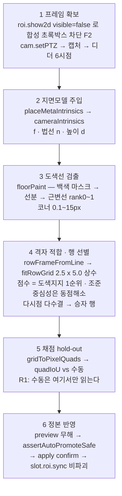
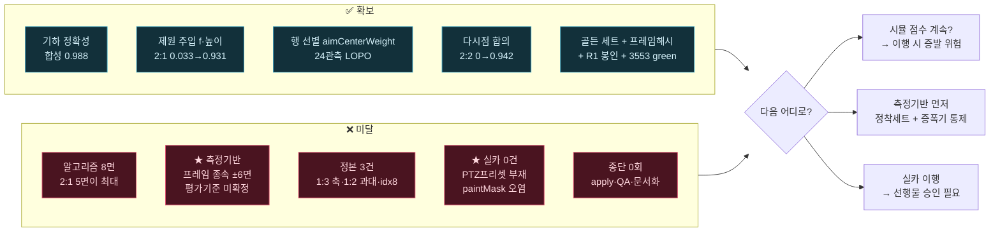

# 주차면 자동 생성 — 목표 · 방법 · 현재 진행 · 안 된 부분

- 작성: 2026-07-29 14:54 / 현자 라 (분석 세션 — 구현 세션과 별개)
- 기준: **14회차 종료**(`02n`, 13:54). **15회차 보고서는 아직 없다**(14:54 확인)
- 성격: **상태 기준 정리.** 연대기가 아니라 "지금 어디에 있는가"를 층별로 정리한다
- 범위: 분석·정리만. 소스·정본·DB 무변경

> ## 📄 문서 지도 — 어느 것을 언제 읽나
>
> 같은 주제 문서가 4개다. 목적이 다르다.
>
> | 문서 | 성격 | 언제 |
> |---|---|---|
> | **이 문서** | **상태 정리** — 목표·방법·된 것·안 된 것 | **처음 보는 사람 / 현황 파악** |
> | `20260729_143656_..._14회차_전체기록과_다음액션.md` | **연대기** — 1~14회차 서사 + **반증 20건** + 실카 정찰 | **재개 세션이 필독.** 특히 반증 목록 |
> | `20260729_143345_..._14회차후_방향재점검.md` | **의사결정** — 방향 판정 + **15회차 지시서** | 다음 라운드를 지시할 때 |
> | `20260729_010651_MCP자동_바닥ROI_생성_설계.md` | **설계서** — 원래 구조 | 구현 세부가 필요할 때 |
> | `_workspace/00_leader_handoff.md` | **지식 정본** — F/U/반증 | 세션 인계 |

---

## 1. 목표

### 1-1. 무엇을 만드는가

> **카메라 이미지에서 노면 도색선을 검출해, 주차면(바닥 ROI) 사각형 4점을 자동으로 생성한다.**

지금까지 주차면 ROI는 **사람이 브라우저에서 손으로 그렸다.** 카메라 1대·프리셋 1개당 수 면씩, 현장이 늘어날수록 선형으로 늘어나는 수작업이다. 이것을 자동화하는 것이 목적이다.

**출력:** `PtzCamRoi.json` 의 `parking_spaces` 에 넣을 수 있는 픽셀 4점 × N면
**경로:** `roi.auto.detect`(무해) → `roi.auto.score`(채점) → `roi.auto.apply`(정본 반영, confirm 필요)

### 1-2. 성공을 무엇으로 정의하는가 — **세 번 바뀌었다**

| 시점 | 기준 | 사유 |
|---|---|---|
| 착수~13회차 | 면별 IoU **≥ 0.98** | 초기 설정 |
| **14회차 (마스터 결정)** | 면별 IoU **≥ 0.95** | 0.98 은 **정답지 정밀도를 재지 않고** 세운 기준. 경계오차 환산 시 0.98=2.5cm / 0.95=6.4cm 이며, 계통 드리프트 1.2~1.5px 가 0.98 예산의 **90~113%** 를 먹어 원리적으로 불가였다 |
| **14회차 이후 (제안, 미승인)** | **3층 분리** | 아래 |

**⚠ "21면 개별 ≥0.95" 는 정의상 도달 불가하다.** `1:3` 2면이 `graded:false`(`D1_TOO_FEW_BAYS` — 2면뿐이라 검증 불가)이므로 **채점 가능 상한이 19면**이다. 목표 문구가 아직 이 사실을 반영하지 않고 있다.

**제안된 3층 목표(방향재점검 문서 §4, 마스터 승인 대기):**

| 층 | 정의 |
|---|---|
| **G1** 정확도 | 정착 프레임 세트(v2) 위에서 **graded 19면 개별 ≥0.95** |
| **G2** 강건성 ★신설 | **프레임 강건성 — 이동직후 vs 정착 프리셋 평균 격차 ≤ 0.02** (현재 `2:1` **0.112**) |
| **G3** 실카 | **정답지 확보 후 정의**(R10 — 지금은 정의조차 불가) |

> G2 가 신설된 이유는 §4-2 를 보라. 14회차가 **점수보다 강건성이 먼저**라는 것을 실측으로 보였다.

### 1-3. 절대 제약 (어기면 결과가 무의미)

| # | 제약 | 왜 |
|---|---|---|
| **R1** | 수동 `parking_spaces` 는 **채점에서만** 읽는다 | 정답지를 입력에 쓰면 자동화가 아니다. **타입·모듈경계·정적봉인 3중**(14회차에 메타 테스트 추가) |
| **R2** | 선형 최소제곱. `Math.random`·RANSAC 금지, 순회순서 고정 | 결정론 — 같은 입력이 같은 출력을 내야 라운드 비교가 성립 |
| **R3** | 정점 순서 하드코딩 금지 | 데이터에서 판별해야 일반화된다 |
| **R4** | `quadIoU`·`assertAutoPromoteSafe`·`gridToPixelQuads` 재사용 | 신규 IoU 구현은 채점을 자기에게 유리하게 만든다 |
| **R5** | DB 쓰기는 **`slot.roi.sync` 만** | `slot.roi.load`·`replaceSlotSetup` 은 검출·점유·센터링 **전량 소실**(실측 23→0) |
| **R6** | 채점·미리보기(무해) / `apply`(destructive+confirm) 분리 | 기존 웹 흐름 무접촉 |
| **R7** | 영속화 소수점 최대 5자리 | 프로젝트 공통 규약 |
| **R10** | **시뮬 수치로 실카를 대변 금지** | 미검증은 미검증으로 표기 |

---

## 2. 방법 — 어떤 원리로 푸는가

### 2-1. 핵심 아이디어

**지면모델을 추정하지 말고 주입한다.** 이미지가 공급하는 것은 3자유도(격자의 원점·방위·위상)뿐이다.

초기에는 소실점에서 초점거리 `f` 를 추정했다. **실패했다** — 참 분리선이 645px인데 차량 가림으로 검출 스텁이 평균 24px 이고, 24px 에서 서브픽셀 잡음은 **±2.4° 각도 불확실성**을 만들어 소실점을 수천 px 날린다. `f` 오차가 −83.7%까지 났고, **`f` 가 맞은 유일한 프리셋이 IoU 가 0 이 아닌 유일한 프리셋**이었다.

→ **`f` 는 카메라 제원에서 계산한다.** `f = imgH/2 / tan(fov/2)`, 지면 법선은 tilt 에서, 카메라 높이는 실측. 전부 **카메라 사실**이지 주차면 정답이 아니므로 R1 무위반이다.

지면모델이 주어지면 슬롯 치수 **2.5 × 5.0m 는 상수**이므로 남는 미지수는 격자의 원점·방위·위상뿐이다. 탐색 공간이 수천 → 수십으로 줄어든다.

### 2-2. 파이프라인 6단계



### 2-3. 각 단계에서 확립된 사실

| 단계 | 사실 | 근거 |
|---|---|---|
| 1 | **시뮬이 초록 주차면 박스를 렌더한다 → 반드시 끈다** | `roi.show2d {visible:false}`. `preset.setBoxVisible` 은 **무효**. 끄면 `1:2` 백색 2.47→4.49%(**박스가 도색선을 덮고 있었다**) |
| 2 | **`f` 는 주입**(F5) · **설치고 = 4.950m**(F6, 명목 5.0m 아님, 3중 독립 확인) | 주입 후 `2:1` 0.033 → **0.931** |
| 3 | **도색선은 5개 프리셋 전부에 실재**(F1, 백색 1.99~5.67%) · **참 전방선은 이미 검출·상위랭크**(F3, `2:2` rank1 = **0.07px**) | 검출단은 잘 작동한다 |
| 4 | **다중 행 장면이 표준**(F11) — 0.977 받는 `1:1` 프레임에도 두 번째 도색 행이 있다 → **`aimCenterWeight` 는 필수 구성요소**(1.6, 상한 2.2, 24관측 LOPO 「검증됨」 — **시뮬 한정**) | 도색 증거만으로는 어느 행이 대상인지 원리적으로 못 가른다 |
| 4 | **참 치수 = 2.5 × 5.0m**(F7, 유니티 `preset.list`) · **정점 배정은 정답지 없이 판별된다**(F8, V7) | |
| 5 | **기하 자체는 맞다**(F9) — 합성 장면(정답 해석적)에서 전 면 **0.9879~0.9959** | 구현이 아니라 실장면 조건이 문제 |
| 5 | ★ **프레임 해시 없는 IoU 는 해석 불가**(F13) | §4-2 |

---

## 3. 현재 진행된 것 (확보한 자산)

> 회차별 서사는 `20260729_143656_..._전체기록과_다음액션.md` 를 보라. 여기서는 **무엇을 확보했는가**만 정리한다.

### 3-1. 알고리즘 자산

| 자산 | 상태 |
|---|---|
| **기하 파이프라인 전체** | 동작. 합성 장면 0.9879~0.9959 로 구현 정확성 검증됨 |
| **제원 주입 경로**(`cameraIntrinsics` · `placeMetaIntrinsics`) | 확립. 실카 인터페이스(`lens_calibration.json`)까지 설계됨 |
| **도색선 검출**(`floorPaint`) | 동작. 참 전방선이 rank0~1 로 나온다 |
| **행 선별**(`aimCenterWeight` = 1.6) | 24관측 LOPO 4/4 「검증됨」 — **시뮬 한정** |
| **다시점 합의**(디더 6시점 다수결) | 서비스 배선 완료. `2:2` 를 **0 → 0.94182** 로 살렸고, 잘 되는 프리셋(`1:1`·`2:1`)은 **만장일치라 무변화** |
| **tilt 보정** | 14회차에 실결함 수정 — 디더 프레임에 기저 tilt 로 모델을 세우던 버그. ≥0.95 **11면 → 13면** |
| **2-DOF 재적합** | 근변 오프셋 `1:1` 0.0800→0.0398m · `2:1` 0.0563→0.0336m |

### 3-2. 측정·안전 기반 ★ 14회차의 최대 성과

| 자산 | 내용 |
|---|---|
| **골든 프레임 세트** | `test/fixtures/roiAutoGolden/` **30장**(5프리셋 × 디더 6시점) + `manifest.json`(프레임별 `sha256_12`·PTZ·디더). **규약: 앞으로 알고리즘 비교는 이 세트 위에서만** |
| **프레임 해시 배선** | `roi.auto.detect`/`score` 응답 + 합의 issue 의 시점별 6개 |
| **R1 정적 봉인 + 메타 테스트** | `bayGrid.ts` 를 봉인목록에 추가(green) + **신규 검출 모듈이 봉인·예외 어디에도 없으면 실패**하는 메타 테스트. `bayGrid.ts` 가 그렇게 2라운드를 빠져나갔던 구멍을 막았다 |
| **반증 목록 20건** | 그럴듯하지만 틀린 가설 20개를 실측으로 죽였다. **재개 세션이 이걸 건너뛰면 몇 시간을 잃는다** |
| **회귀** | `tsc --noEmit` exit 0 · vitest **281파일 3553테스트 전량 green** |
| **안전 상태** | 정본은 마스터 지시분 외 무변경 · DB 비파괴 경로만 · `roi.auto.apply` **0회** · 서버 재시작 0회 |

### 3-3. 현재 성적 (골든 세트 기준, 현재 기본 = 선별 tilt보정)

| 프리셋 | 면수 | **≥0.95** | ≥0.98 | 평균 | 기저 프레임 |
|---|---|---|---|---|---|
| **1:1** | 7 | **7 / 7** | 0 | 0.97474 | `6006a034bfe2` |
| **1:2** | 4 | **3 / 4** | 1 | 0.95373 | `ceaaed722663` |
| **2:1** | 6 | **1 / 6** | 0 | 0.85402 | `e33628e921c2` |
| **2:2** | 4 | **2 / 4** | 0 | 0.94182 | `0cf4fda4d3aa` |
| 1:3 | 2 | `graded:false` | — | — | `3c0db12efe75` |
| **전체** | **21** | **13** | **1** | 0.77644 | |

> **이 표는 프레임 해시와 함께 읽어야 한다.** 다른 프레임에서는 같은 코드가 `1:1` 0/7, `2:1` 4/6 을 낸다(§4-2).

---

## 4. 현재 안 된 부분

**귀속을 분명히 한다.** "안 됐다"가 알고리즘 탓인지, 정답지 탓인지, 측정 탓인지, 아직 시작을 안 한 것인지 섞으면 판단이 오염된다.

### 4-1. 알고리즘 소관 — 8면 미달

| 프리셋 | 미달 | 크기 |
|---|---|---|
| **2:1** | **5면** | 평균 0.854 — **최대 결손** |
| **2:2** | 2면 | 0.9364 · 0.9031 |
| 1:2 | 1면 | s8 = 0.9073 |

**⚠ 단, 이 숫자 자체가 잠정이다** — `2:1` 의 골든 기저는 **정착본**이고 이동직후본에서는 4/6 이 나온다. **프레임 조건이 프리셋마다 비균질**해서 `2:1` 결손의 진짜 크기를 아직 못 잰다.

### 4-2. ★ 측정 기반 소관 — 이것이 현재 최대 결손

> **같은 PTZ·같은 코드인데 잡힌 프레임에 따라 ≥0.95 통과면수가 ±6면 변한다.**

```
1:1  프레임 65182cdf → 0.85541 (0/7)     |  2:1  프레임 80cdf49c → 0.96614 (4/6)
     프레임 6006a034 → 0.97474 (7/7)     |       프레임 e33628e9 → 0.85402 (1/6)
```

각 프레임은 **재현 100%** — 잡음이 아니라 **결정론적 종속**이다. 변동 폭이 8~13회차 알고리즘 개선분 전체보다 크다.

| # | 결손 | 상태 |
|---|---|---|
| **M1** | **7~13회차 회차간 비교가 무효** | 0.72496 → 0.74229 → 0.75668 이 알고리즘 개선인지 프레임 운인지 **구분 불가**. 그 라운드들의 프레임은 남아 있지 않아 **재평가도 불가** |
| **M2** | **평가 프레임 기준 미확정** | 현행은 "PTZ 이동 직후 1장". **정착 후**면 `2:1` 0.966→0.854, `1:2` 0.954→0.759. **실카는 정착 후를 찍는다** → 튜닝이 아니라 **평가 기준 확정** 문제 |
| **M3** | **자가보정이 증폭기** — 미탐색 최대 단서 | 화소 MAD 0.068 프레임 차이 → 칸간격 −4.9% → **IoU 0.21 이동**. `CALIB=0` 에서 `1:1` 0.855→**0.932**, `2:1` 프레임 격차 0.115→**0.0002 소멸**. **반증 목록에 없다** |
| **M4** | **씬 변화 미확정**(U17) | 3분에 9종 프레임 vs 4분 바이트 동일. 실카 정찰 간섭 가능성이 남아 판정 보류 |
| **M5** | 드리프트 원인 미규명(U1) | 후보 **12건 소거**, 남은 1종(지면 비평면)도 약함. **마스터 지시로 탐색 중단** — 0.95 목표에서는 관문이 아니다 |

### 4-3. 정답지(정본) 소관 — 알고리즘으로 못 고침

| # | 결손 | 상태 |
|---|---|---|
| **C1** | **`1:3` 축 뒤바뀜** | 자동 5.000/2.500 vs 수동 2.553/5.106. **모델 표현 범위 밖.** `graded:false` |
| **C2** | **`1:2` 수동 5~12% 과대** | 2.635~2.809 × 5.271~5.380 (참 2.5×5.0). **단 채점 제외는 논쟁 중** — §4-5 |
| **C3** | **`idx8` 앵커** | 앵커 186.39px / 이웃 177.09px — **둘 다 도색선에 안 붙는다**. 근거 없이 정본을 못 고쳐 보류. 독립 두 측정이 같은 결함을 지목 |

> `1:1`(2.500/5.001)·`2:1`(2.505/5.010) 수동은 **정확하다**. 정본 결함은 국소적이다.

### 4-4. 실카 소관 — **검증 0건. 구조적 블로커 있음**

**이 프로젝트 전체에서 실카(RTSP) 파이프라인 검증은 0건이다.** 24관측 LOPO 도, 다시점 합의도, `aimCenterWeight` 「검증됨」도 **전부 시뮬**이다.

14회차 실카 정찰(최초 실측)이 드러낸 것:

| # | 결손 | 심각도 |
|---|---|---|
| **L1** | ✅ **도색선 실재 확인**(백색 6.79%) | **접근 전체의 전제가 성립한다 — 가장 큰 소득** |
| **L2** | **PTZ 프리셋이 정의돼 있지 않다**(`"현재 위치"` 1개) | ★ **구조적** — 프리셋별 지면모델 주입이 **그대로는 안 돈다** |
| **L3** | **백색의 상당분이 흰 차량** (20대 중 절반 가까이 백색·은색) | ★ **`paintMask` 가 차체로 오염된다.** 시뮬은 차량이 어두워 백색=도색선이었다 |
| **L4** | 주차 행이 **4~5줄**(시뮬 2줄) · 장면 절반이 주차장이 아님(건물·나무·전신주) | 나무 그림자·외벽이 **유사 직선 증거**를 만든다 |
| **L5** | **펌웨어 `f` 를 믿으면 안 된다**(U15) | `focalTrue` vs `focalFirmware` 최대 **7.7%** 어긋남 |
| **L6** | `real-camera-2`(154) 자체 캘리브 없음 | `focalTrue` 보유는 `real-camera-1`(153)뿐 |
| **L7** | 곡면율(렌즈왜곡) 지금 쓸 수 없다(U16) | `k1`/`k2` 부재·PTZ 시차 미분리. 순서: `focalTrue` 보간 → 직진성 재측정 → 그때도 휘면 재캘리브 |
| **L8** | 정착 프레임 하락 증거 | §4-2 M2 |
| **L9** | **실카 채점용 수동 정본이 없다** | 없으면 실카에서 **수렴 판정 자체가 불가** |

### 4-5. 운영·결정 대기 — 착수 전에 필요

| # | 건 | 상태 |
|---|---|---|
| **A1** | **`selectedCameraId` 가 아직 `real-camera-2`** | `config/tools.config.json:98`, mtime **12:46:53**(주체 미상). **이 상태의 라이브 채점은 전부 무효.** 실측 확인함 |
| **A2** | **`1:2` 채점 제외 — 구현자 반대** | 제외 권고 근거인 "최대 IoU 0.827~0.900" 이 **지상고 자가보정이 격자 배율을 자유롭게 만들어 구속력을 잃는다**(실측 s11=**0.9825** 가 상한 초과). `1:2` 는 현재 **≥0.95 3/4 로 최고 프리셋**이고 제외 시 통과면 3개가 사라진다. **회신 전까지 현행 유지·양쪽 병기 중** |
| **A3** | P2 좌표 융합 미배선(지시 문언 이탈) | 3기준 전패(13→10면)라 진단 도구로만 보존. 플래그로라도 넣을지 |
| **A4** | **골든 세트 10.0MB 커밋 여부** | `test/fixtures/` 라 `.gitignore` 미적용 |
| **A5** | 정본 결함 3건 착수 여부 | C1·C2·C3 |
| **A6** | 실카 이행 선행물 승인 | PTZ 프리셋 정의 · 채점 정본 작성 · 카메라 확정(`real-camera-1` 권고) |

### 4-6. 종단 미완

| # | 항목 |
|---|---|
| **E1** | **`roi.auto.apply` 실정본 실행 0회.** 구현·임시파일 테스트만. 승인 대기 |
| **E2** | DB 고아 행 `slot_id 24` — 파일에선 제거됐으나 **삭제 RPC 가 없다** |
| **E3** | ★ **CLAUDE.md 5대 규칙의 마감 단계 미실행** — 루프가 성공 판정에 도달하지 않아 **qa-tester(검증)·documenter(문서화·영향도분석) 가 아직 안 돌았다** |

---

## 5. 한 장 요약



**현재 위치를 한 문장으로:**

> 기하는 맞고(합성 0.988), 시뮬 골든 세트에서 **13/21 면이 ≥0.95** 다. 그러나 **그 수치가 어느 프레임을 잡았느냐에 ±6면 종속**되고, **실카는 한 번도 안 돌려봤으며**, 실카 정찰에서 **PTZ 프리셋 부재·`paintMask` 백색차량 오염**이라는 구조적 블로커가 나왔다. 즉 **성능 문제가 아니라 측정 기반과 이행 준비가 현재 병목**이다.

---

## 6. 다음 방향 (요약 — 상세는 방향재점검 문서)

| 순위 | 작업 | 겨냥 |
|---|---|---|
| **0** | **`selectedCameraId` 시뮬 복귀**(A1, 마스터 확인) | 라이브 측정 유효화 |
| **1** | **정착 프레임 골든 v2 확립 + 재채점** | M2 — 평가 기준 확정 |
| **2** | **자가보정 증폭기 A/B/C 통제**(현행 / OFF / 시점 중앙값 공유) | **M3** — 미탐색 최대 단서 |
| **3** | **실카 이행 선행물 보고**(PTZ 프리셋·채점 정본·카메라 확정) | L2·L9·L6 |
| — | 시뮬 점수 튜닝 | **중단 권고** — 이행 시 증발 위험 |

> `2:1`(1/6)은 **지금 직접 파지 않는다** — 프레임 조건 비균질 + 증폭기 경유분과 교락돼 있다. 1·2 가 `2:1` 분석의 **전처리**다.

---

## 7. 불확실 · 정직 표기

| 항목 | 상태 |
|---|---|
| **15회차 결과** | **보고서 없음**(14:54 기준 `02n` 이 최신). 이 문서는 **14회차 종료 상태** |
| §3-3 성적표 | 골든 세트 기준 **실측**(14회차 §2). 단 **프레임 종속**이므로 다른 프레임에서 재현되지 않는다 |
| §4-1 "알고리즘 8면" | **잠정** — `2:1` 기저가 정착본이라 프레임 조건이 비균질하다 |
| `CALIB=0` 수치 | 14회차 보고서 **인용**. 전용 플래그는 커밋 코드에 없고 `calibrateHeight:false` 로 재현 가능 |
| 골든 v1 30장의 이동직후/정착 구성 | **미분류** — v2 작업 중 대조 필요 |
| `aimCenterWeight` 「검증됨」 | **시뮬 한정**(R10). 실카 대변 아님 |
| 실카 정찰 | `real-camera-2` **1프리셋 1장**. 카메라·시간대 일반화 안 됨 |
| U17 씬 변화 | **판정 보류** — 실카 정찰과 동시 진행돼 간섭 가능성 |

---

## 8. 영향도

| 대상 | 영향 |
|---|---|
| **진행 중 goal/loop 세션** | **없음.** 이 문서는 신규 파일 1개. `_workspace/*`·`src/*`·정본·DB 무접촉 |
| 소스 | **0줄 변경** |
| 정본 `PtzCamRoi.json` · DB | **무접촉** |
| 회귀 | 무변경(3553 green 유지) |
| 기존 문서 | 대체하지 않는다. **연대기·의사결정 문서와 역할 분담**(문서 지도 참조) |
| R1~R10 | 이 문서는 읽기·정리만. 위반 없음 |
