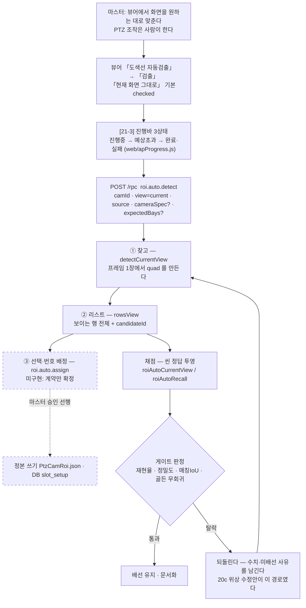
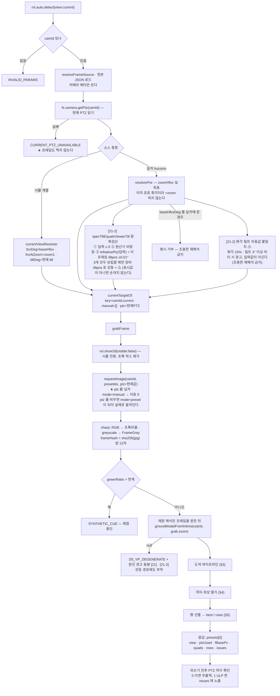
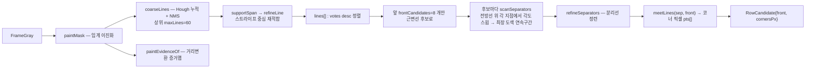
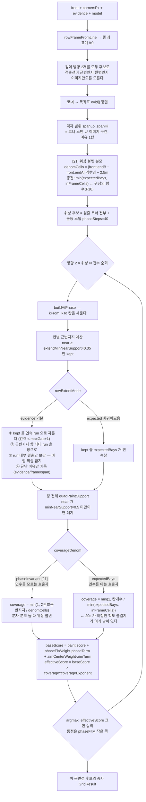
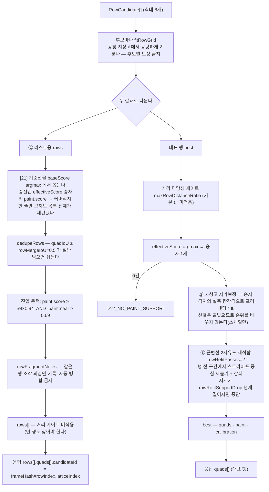
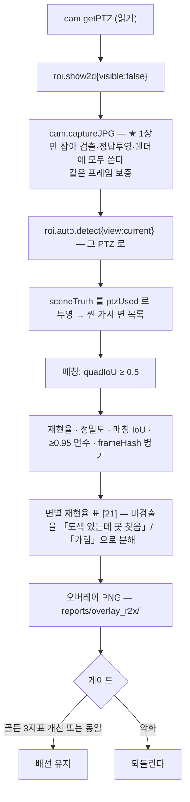
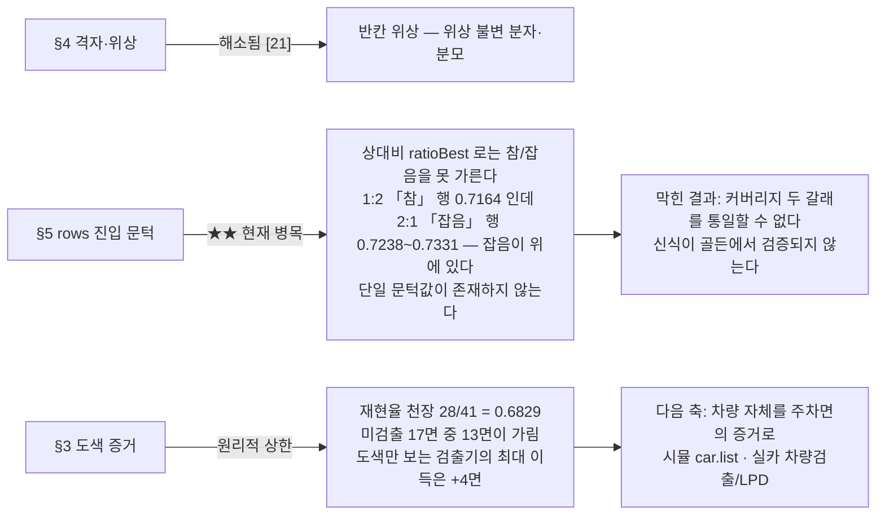

# 주차면 자동생성 순서도 — 20~21회차 방향성 기준

- 작성: 2026-07-30 15:45 / 리더(별 세션. **주차면 자동생성 작업 세션과 독립**)
- 개정: 2026-07-30 17:02 / 리더(주차면 세션) — 21회차 **Phase 2(실카 복구)·Phase 3(진행바)** 반영. 원 작성 15:45 시점엔 Phase 2/3 이 진행 중이라 미반영이었다(§0 말미 참고).
- 목적: 20회차가 확정한 방향성(「현재 화면 그대로 검출」 + 3단계 분리)에 맞춘 **전체 순서도**를 코드 실물 기준으로 그린다.
- 근거(읽은 것): `메모/memo.md`(20회차·21회차 Phase 0/1/2/3 항목) · `docs/20260730_020139_MCP자동바닥ROI_20회차_현재화면그대로검출.md` · `docs/20260730_020510_20회차_인계서_다음세션용.md` · `docs/20260730_115425_주차면_개별독립검출_설계.md` · `_workspace/02ac_developer_changes_round21_phase2_realcam.md` · `_workspace/02ad_developer_changes_round21_phase3_progressbar.md` · 코드 `src/rpc/services/roiAuto.ts` · `src/ground/{bayGrid,floorPaint,bayGeometry,cameraIntrinsics}.ts` · `web/apProgress.js`
- **성격: 문서만.** 코드·정본·DB 를 한 줄도 건드리지 않았다. 다른 세션이 같은 주제를 진행 중이므로 신규 파일만 추가한다(20회차 함정 (f) 회피).

---

## 0. 「20회차 방향성」의 정의 (이 순서도가 지키는 5원칙)

| # | 원칙 | 근거 |
|---|---|---|
| **P1** | **카메라를 움직이지 않는다.** 지금 보이는 화면(현재 PTZ)이 곧 카메라 제원이다 | 20회차 V1 PASS. 실카엔 프리셋이 없어 프리셋 구동은 입력 자체가 없다 |
| **P2** | **f = f@zoom1 × zoom.** 화각 입력은 「기준(줌1) 수평화각」 | 5프리셋 앵커 검산 \|Δf\| ≤ 0.001px |
| **P3** | **3단계 분리** — ①찾고 → ②리스트 → ③선택(번호 배정) | ③은 정본 쓰기라 계약만, 라우트 미등록 |
| **P4** | **정본 hold-out.** 검출은 주차면 좌표·개수를 입력으로 받지 않는다. 채점은 씬 정답을 현재 PTZ 로 투영(뷰 독립) | R1 · `manual: []` · `sceneTruth` |
| **P5** | **프레임 해시 없는 수치는 무효**(F13). 다시점 합의는 현재뷰에서 강제 OFF | 시뮬 씬이 정지하지 않는다 |

21회차 Phase 0/1 이 이 방향성을 **바꾼 게 아니라 한 칸 더 밀었다**: `expectedBays` 가 산출식에서 사라져(위상 불변 분모) P4 가 개수까지 확장됐고, 20회차가 발견한 반칸 위상이 그 경로에서 해소됐다. 순서도에 **[21]** 로 표시한다.

Phase 2(실카 오류 3건 복구)·Phase 3(뷰어 진행바)는 검출 알고리즘 자체를 바꾸지 않았다 — Phase 2 는 제원 해석(P2 의 실카 쪽 구현)의 **리더 진단 오류 2건을 실측으로 정정**했고, Phase 3 은 UI 전용이다. 순서도에 각각 **[21-2]**·**[21-3]** 으로 구분 표시한다.

---

## 1. 레벨 0 — 전체 순서도

**중요한 비대칭**: ①②는 읽기 전용이고 ③만 쓰기다. 그래서 `roi.auto.score`·`roi.auto.apply` 는 `view:"current"` 를 **명시 거부**한다(수동 정본이 프리셋 종속이므로 현재뷰 개념과 맞지 않는다).

### 1-1. 뷰어 진행바 3상태 [21-3]

서버가 단계 진행을 보고하지 않으므로 시간으로 채우는 막대는 **추측**이다 — 「조용히 틀리지 마라」를 UI 에도 적용해 판정을 순수 모듈(`apEta`·`apProgressState`·`apDoneSummary`·`apProgressAria`, DOM·fetch 미참조)로 분리했다.

| 상태 | 조건 | 막대 | `aria` | 문구 |
|---|---|---|---|---|
| ① 진행 중 | `경과 < 예상` | 확정 폭 `min(0.99, 경과÷예상)` | `aria-valuenow` 있음 | `25%` |
| ② 예상 초과 | `경과 ≥ 예상` | **불확정** — 좁은 띠(28%) 왕복, **채우지 않는다** | `aria-valuenow` **제거** | `예상 시간 초과 — 계속 진행 중` |
| ③ 완료·실패 | 응답 도착 | 막대 숨김 → 결과 요약 | 제거 | `완료 — 검출 7면 · 프레임 6006a034bfe2 · 소요 12.3초` / `실패 — 거부 — 설치고 (소요 2.5초)` |

- **핵심 규율: 끝나기 전에 100% 를 보이지 않는다**(① 구간 상한 **0.99** 클램프, 테스트: 경과 11999/12000 → 99%). 예상 시간을 아예 모르면(`etaMs=0`) 처음부터 불확정이며 `"진행 중"`(초과라고 말하지 않는다). 값이 없으면 `—` 로 남긴다(지어내지 않는다). **취소는 만들지 않았다**(요청 범위 밖 — 부재를 테스트로 봉인).
- **ETA 는 전부 라이브 실측**(2026-07-30, 13020 왕복 전체 시간):

| 조건 | 실측 | 채택 ETA |
|---|---|---|
| 시뮬 현재뷰(무이동) | 12140 ms · 12104 ms | 12초 |
| 시뮬 프리셋 단일시점 | 12070 ms | 12초 |
| **실카 현재뷰** | **14519 ms · 14738 ms** | **15초**(RTSP 스냅샷이 시뮬보다 ~2.5초 느리다 — 신규 분기) |
| 다시점 합의(6시점) | 68759 ms | 70초(종전 표기가 실측과 맞음을 **처음 확인**) |

- ETA 는 `web/apProgress.js` **한 곳**에서 나와 진행바·문구가 같은 값을 쓴다(어긋날 수 없다). 스샷 `reports/overlay_r21d/ap_progress_{1_running,2_overdue,3_done,all}.png`.
- **한계**: 브라우저 자동화가 없어 스샷은 **SVG 재현**이다(색·치수는 `web/app.css` 파싱, 문구·진행률은 `apProgress.js` 호출이라 로직·팔레트와는 어긋날 수 없다). 그러나 **폰트·자간·flex 배치·CSS 애니메이션은 재현하지 못한다** — 배치·정렬의 최종 확인은 마스터 브라우저 육안이 필요하다.

---

## 2. ① 찾고 — `detectCurrentView` → `detectOne`

- 되쓰기 1 ULP(tilt 1.9e-6°)는 Unity quaternion↔euler 양자화이고 **2회차부터 고정점**이다. 물리적 이동이 아니다.
- 실카에는 되쓰기 자체를 하지 않는다(마스터가 조작 중일 수 있다).

### 2-1. 실카(hucoms) 제원 해석 — 리더 진단 2건 정정 [21-2] ★★

이번 개정에서 가장 큰 정정 항목이다. **「실카 틸트 부호가 뒤집혀 있다」는 리더의 원 진단은 틀렸다.**

- 뷰어 tilt 는 **각도가 아니라** 네이티브 tiltpos 를 `[-90,90]` 에 선형 range-fit 한 **위치**다(`roiAuto.ts:566` 주석에 이미 명시돼 있었다).
- `real-camera-1` 의 뷰어 tilt `-29.9781818` → 네이티브 `tiltpos 1668` → **참 하향각 16.68°**.
- 부호만 뒤집으면 `+29.978°` 가 되어 참값보다 **13.2982° 과대** — 조용히 틀린 기하로 검출하게 된다.
- 뷰어 **−57.27 이 네이티브 0**, 뷰어 **0 이 하향 35°** — **어느 부호를 골라도 각도가 아니다.**

| 소스 | 뷰어 tilt | 네이티브 | 참 하향각 | 뷰어 값의 정체 |
|---|---|---|---|---|
| `simulator-1` | +8.7 | 환산 없음 | 8.7° | **각도 그 자체**(양수=아래) |
| `real-camera-1` | −29.9781818 | `tiltpos 1668`(pan 4771·zoom 4956) | **16.68°** | **range-fit 위치** |

- **처방은 `abs()`·무조건 반전이 아니라 왕복 검산이다**(§2 다이어그램 `A6T`): ①입력 ≤ 0 ②환산기 비항등 ③`toNativePtz(입력) ≈ 이 프레임 tiltpos ±0.01°` 가 전부 통과할 때만 "표시값을 그대로 옮겨 적었다"로 보고 장비 tiltpos 로 강등 + ⚠. **상향 시선 은닉은 유닛테스트로 봉인**했다(표시값이 아닌 −29° 는 손대지 않고 `focalPx=null` 유지).

★ **교락(confounding) 교훈 — 반드시 기억할 것**: 리더가 "부호 뒤집으니 살아났다(칸간격 2.5031m)"를 근거로 정정을 제안했었는데, 이때 `f` 는 1731.9(틀림, 참값 3051.1)였고 **지상고 자가보정이 그 오차를 흡수해** 칸간격이 그럴듯하게 나온 것이었다. **두 틀린 값이 서로 보상하는 고전적 교락**이다. 「살아났다」·「그럴듯한 수치가 나왔다」를 그 자체로 성립 근거로 쓰지 말 것.

**캘리브 사실 정정**: 리더는 "`real-camera-1` 은 캘리브가 아예 없다"고 진단했으나, `data/lens_calibration.json` 에 **13점 `zoomHfov` 실측표가 이미 있다.** 없는 것은 **`cameraSpec.heightM` 하나**뿐이고, `INTRINSICS_MISSING` 거부 사유도 그 1건이다. **설치고 13m 은 파일에 쓰지 않았다** — `real-camera-2` 의 13m 을 복제할 근거가 없고(같은 기종이라는 증거 없음), 설치고는 줄자 실측 사안이다(§7-1·§10 미해결로 등재). `real-camera-1` 의 13점 실측표 자체는 `real-camera-2` 와 달리 `verdict:'pass'` 검증 파일이 **없다**(미검증 — §10).

**화각 수동입력 함정 + 경고 신설**: 마스터가 「수평화각(유효)」에 **58** 을 입력했으나, zoompos 4956 의 실측 유효 화각은 **34.9314°**, f **3051.099px** 다. 58° 로는 f **1731.886px** = **0.5676배**(43% 작음)로 계산되어 주차면 크기·거리가 함께 틀어진다.
→ **「자동값과 15%(화각)/3°(틸트) 이상 다르면 ⚠」 경고를 신설**했다(§2 다이어그램 `A6H`). 16~19회차 인계서 §0-1 의 미착수 항목을 이행한 것이다. **입력값이 이기는 규약은 유지**한다(조용한 재해석 금지) — 경고만 하고 계산은 입력값으로 한다.

**`expectedBays: 0` 전송 결함(D1, 마스터가 실제로 본 에러)**: `apNum('ap-bays')`(`web/app.js`)가 **빈 칸만** `undefined` 로 만들어 `0` 을 그대로 전송했고, 서버 스키마 `z.number().int().min(1)` 이 `invalid params` 로 거부했다. **보내는 쪽**을 고쳤다(`Number.isInteger(baysRaw) && baysRaw >= 1` 만 전송 + "0 은 미지정으로 처리했다" 안내). **서버 스키마는 엄격 유지** — 계약을 느슨하게 하면 다른 클라이언트가 같은 함정에 빠진다. **칸에 0 이 있던 경위는 미측정**이다(HTML `min="1"` 은 검증 속성이라 입력 자체를 막지 않는다).

**`D5_VP_DEGENERATE` 강등 경로에 경고 동봉**: 종전엔 제원 해석이 실패해 강등되는 그 순간 원인 설명이 함께 버려졌다 — **마스터가 실제로 본 화면이 이 경로였다.** 유닛테스트가 이 회귀를 잡는다(§2 다이어그램 `E5`).

---

## 3. 도색 증거 파이프라인 (`floorPaint.ts`)

**왜 전역 Hough 로 분리선을 못 찾나**: 분리선은 차량에 가려 30~120px 스텁뿐이라 차체 모서리 수백 개에 묻힌다. 전방선을 먼저 얻고 그 위에서 국소 탐색해야 살아남는다. 대가는 오검출 증가이며, **21회차 Phase 0 이 그 대가를 정량화했다 — 행당 오검출 분리선 32개(참 면 3.4개).** 그래서 「분리선 쌍으로 면 닫기」(A안)는 정밀도 상한 0.35~0.46 으로 기각됐다.

---

## 4. ★ 격자·위상 열거 — `fitRowGridOnce` (이 파이프라인의 심장)

### 4-1. 20회차 최대 발견이 어디서 났고 21회차가 어디를 고쳤나

| | 20회차 진단 | 21회차 Phase 1 조치 |
|---|---|---|
| 분자 | `quads.length`(칸 **개수**) ↔ `paint.score`(칸당 **평균**) 척도 불일치. 반칸 위상이 온전한 1칸을 반쪽 2칸으로 쪼개 개수를 늘려 이긴다 | `Σ 칸별 근변지지`(증거 가중 유효 칸수) |
| 분모 | `min(expectedBays, inFrameCells)` — `inFrameCells` 가 위상의 함수(F18). 위상을 밀어 경계 칸을 프레임 밖으로 내보내면 분모가 줄어 **보상**을 받는다 | `denomCells` = 근변 도색 지지 구간 폭 ÷ 2.5m (위상·개수 무관) |
| 결과 | 같은 프레임에서 `bays` 4→8 로 재현율 0.6000→0.0000 (같은 6면 IoU 0.91~0.96 → 0.33~0.40) | 같은 프레임 A 조건에서 `bays 1~16` **전 구간 평탄** · 재현율 0.6000 · 매칭 IoU 0.93337 |

★ **두 축을 동시에 고쳐야 한다.** 분모만 고치면 개수 보너스가 남아 오답이 이기고, 분자만 고치면 F18 이 남는다(둘 다 실측 기각).

★ **부채(은닉 금지)**: 위 표의 두 갈래가 아직 **공존**한다. 면수를 아는 경로(프리셋 정본·사용자 입력)는 종전 식이고, 신식은 **골든에서 검증되지 않는다**(골든은 전부 면수를 아는 경로). 갈래 통일의 선행조건이 §7 의 병목이다.

---

## 5. 행 선별 — `detectBaysWithModel` 의 두 갈래

`candidateId` 에 프레임 지문을 접두로 두는 이유: 순수 인덱스는 다음 검출에서 **말없이 다른 면**을 가리킨다. ③ 선택 단계가 "그때 그 프레임의 그 후보"임을 검증하고, 프레임이 바뀌면 서버가 거절할 수 있어야 한다(F13 과 같은 규율).

---

## 6. 채점 루프 (goal/loop B 모드에서 이게 성공 판정자다)

**골든 기준선(21회차 Phase 1 시점, 원시 배정도)**: 재현율 `0.5853658536585366` · 정밀도 `0.8571428571428571` · 매칭 IoU `0.8886003068644802`(최소 `0.6130202566182261`) · 프레임해시 5개. **Phase 2·3 도 이 3지표·해시 5개를 그대로 재현**했다(검출 로직 무접촉이므로 당연한 결과이지 신규 검증이 아니다).

**전체 회귀 규모**: Phase 2 시점 `tsc` 0 · vitest **291파일 3704 green**. Phase 3 이 `apProgress.js` 유닛테스트 17건을 추가해 **292파일 3721 green**(`_workspace/02ad_developer_changes_round21_phase3_progressbar.md` §5 인용 — 이 순서도 세션이 직접 실행·재확인한 수치는 아니다).

**규율**: `toFixed` 로 "동일"을 판정하지 않는다 · 프레임 해시 없는 IoU 는 무효 · 미추적 파일에 `git diff` 로 미배선을 증명하지 않는다(3중 증거: 코드 직독 + mtime + 골든 재현).

---

## 7. 이 순서도에서 지금 막혀 있는 지점

### 7-1. 실카(hucoms) 검출 실적 [21-2] — 재현율은 **측정 불가**

| 조건(라이브 `real-camera-1`) | frameHash | f(px) | 산출 |
|---|---|---|---|
| 수정 전 | `1ac4f6c51cac` | **null** | **0 quad** · `D5_VP_DEGENERATE` |
| 후 · 마스터 입력 그대로(틸트 −29.978·화각 58·설치고 13) | `36228dd9c213` | 1731.89 | 3 quad·3행(틸트 16.68° 자동복구) |
| **후 · 권장(틸트·화각 비움, 설치고만)** | `4fb3040bce03` | **3051.0992** | 3 quad·1행 · **지상고 자가보정 관측 칸간격 2.5045m vs 규격 2.5m(0.18%)** |
| 제원 전부 비움 | — | — | 명시 거부(`INTRINSICS_MISSING` — 설치고 1건) |

- **실카 재현율·정밀도는 측정 불가**다 — 씬 정답이 없어 분모를 만들 수 없다(`preset.list` 는 시뮬 전용). **없는 정답을 만들지 않았다.** 판정은 ⓐ검출 면수 ⓑ오버레이 육안 ⓒ마스터가 세어 준 면수 대조로 한다(마스터 대조는 아직 없음).
- **리더 육안**(`reports/overlay_r21c/real1_auto.png`): 오류는 사라졌고 기하는 타당하다(전방선이 주차 차량 근변에 얹힘, 칸간격 0.18% 오차). **그러나 화면의 많은 면 중 2~3면만 찾는다.** 원인은 시뮬과 같다 — **차량이 도색을 덮는다**(§7 재현율 천장의 실카판).
- ★ **신규 한계**: 실카에는 **프레임 캐시 경로가 없어** 두 스샷의 frameHash 가 다르다 → **동일프레임 전후 비교가 불가능**하다(F13 한계). 다음 라운드 과제.

| 순위 | 표적 | 왜 |
|---|---|---|
| **1** | `rows` 진입 문턱 **재설계**(다른 판별 축) | 상대비가 판별 불가임이 실측됐다. 이게 되면 커버리지 두 갈래를 통일할 수 있고 그때 신식이 골든에서 검증된다 |
| **2** | 재현율 0.68 천장 돌파 = **가림면을 차량 증거로** | 도색만으로는 +4면이 최대 |
| 3 | 뷰어 「예상 주차면 수」 칸 **제거**(현재 비활성까지만) | 2단계 제거의 2단계. 즉시 제거는 회귀 비교 수단 상실 |
| 4 | ③ 선택·번호 배정(`roi.auto.assign`) 배선 | 정본 쓰기라 마스터 승인 선행 |
| 5 | 실카 임의 뷰 첫 실행 | [21-2] **1회 실행됨**(3 quad, R1~R5 게이트 통과) — 코드 경로 확인. 단 `cam2`·다른 실카는 여전히 0회(R10) |
| 6 | [21-2] 실카 프레임 캐시 경로 신설 | 신규 병목 — 지금은 동일프레임 전후 비교가 불가능하다(F13) |
| 7 | [21-2] `real-camera-1` 설치고 **실측 근거 확보**(줄자) | 파일에 13m 미기재 — `real-camera-2` 복제 근거 없음, 마스터 몫 |

---

## 8. 단계 ↔ 코드 위치

| 단계 | 함수 | 파일:줄 |
|---|---|---|
| 라우트 진입 | `roiAutoDetect` | `src/rpc/services/roiAuto.ts:1182` |
| 현재뷰 분기 | `detectCurrentView` | `src/rpc/services/roiAuto.ts:1133` |
| 제원 해석(현재뷰) | `currentViewResolver` | `src/rpc/services/roiAuto.ts:525` |
| 무이동 대상 | `currentTargetOf` | `src/rpc/services/roiAuto.ts:649` |
| 프레임 취득 | `grabFrame` | `src/rpc/services/roiAuto.ts:679` |
| 검출 1회 | `detectOne` | `src/rpc/services/roiAuto.ts:856` |
| f = f@zoom1×zoom | `focalPxAtZoom` / `groundModelFromIntrinsics` | `src/ground/cameraIntrinsics.ts` |
| 도색선 | `detectPaintLines` | `src/ground/floorPaint.ts:737` |
| 분리선 | `scanSeparators` / `refineSeparators` | `src/ground/floorPaint.ts:764` / `:958` |
| 격자·위상 열거 | `fitRowGridOnce` | `src/ground/bayGrid.ts:272` |
| 위상 불변 분모 [21] | `denomCells` | `src/ground/bayGrid.ts:307-323` |
| 커버리지 두 갈래 | `coverage` | `src/ground/bayGrid.ts:432-435` |
| 행 선별·rows/best | `detectBaysWithModel` | `src/ground/bayGrid.ts:647` |
| rows 기준선 [21] | `refBase` / `refScore` | `src/ground/bayGrid.ts:687-699` |
| 중복 제거 | `dedupeRows` | `src/ground/bayGrid.ts:597` |
| 근변선 재적합 | `refitFrontLineOverRow` | `src/ground/bayGrid.ts:529` |
| ② 리스트 응답 | `rowsView` | `src/rpc/services/roiAuto.ts:1021` |
| 기본 파라미터 | `DEFAULT_BAY_OPTS` / `DEFAULT_PAINT_OPTIONS` | `src/ground/bayGeometry.ts:205` / `src/ground/floorPaint.ts:139` |

### 주요 기본값

`slotWidthM 2.5` · `slotDepthM 5.0` · `maxGap 3` · `minNearSupport 0.5` · `extendMinNearSupport 0.35` · `phaseSteps 40` · `maxRowCells 60` · `coverageExponent 1` · **`phaseFitWeight 0`** · `aimCenterWeight 1.6` · `maxRowDistanceRatio 0` · `rowMergeIoU 0.5` · `rowMinScoreRatio 0.94` · `rowMinNearSupport 0.69` · `rowRefitPasses 2` · `frontCandidates 8` · `maxLines 60`

> `phaseFitWeight = 0` 은 그대로 기록한다 — 위상이 20회차 핵심 결함이었는데 위상 적합 항이 꺼져 있다. 단 **상향 재시도는 반증목록 5번으로 금지**(결함은 항의 부재가 아니라 척도 불일치였고, 그건 [21]이 직접 고쳤다).

---

## 9. 강등·거부 코드

| 코드 | 조건 | 동작 |
|---|---|---|
| `CURRENT_PTZ_UNAVAILABLE` | `cam.getPTZ` 실패 | **프레임도 찍지 않는다** — 어느 화면인지 모르는 검출은 해석 불가 |
| `SYNTHETIC_CUE` | 초록 픽셀 비율 초과 | 시뮬이 주차면 박스를 렌더 중 → `roi.show2d{visible:false}` 후 재호출, 채점 중단 |
| `D5_VP_DEGENERATE` | 제원 공급 실패·소실점 퇴화 | [21] 원인 경고를 함께 싣는다(예 "틸트 ≤ 0 = 상향 시선") · [21-2] **강등 경로 자체에도 경고를 부착**(종전엔 이 순간 원인 설명이 버려졌다) |
| `D12_NO_PAINT_SUPPORT` | 도색지지 기준 넘는 격자 0건 | `rows` 는 그대로 반환, `best` 만 null |
| `INVALID_PARAMS` | `roi.auto.score`/`apply` 에 `view:current` · 실카에 `baseHfovDeg` · `expectedBays` **0**(1 미만) | 조용한 대체 금지 — 명시 거부. [21-2] **UI 가 0 을 보내지 않도록 고쳤다**(서버 스키마는 그대로 엄격) |
| `INTRINSICS_MISSING` | [21-2] 실카 필수 제원 미공급(예: `heightM`) | 명시 거부 — `real-camera-1` 은 13점 `zoomHfov` 실측표가 있어도 설치고 1건이 없으면 거부한다 |

---

## 10. 이 순서도로 확인되지 않는 것 (은닉 금지)

- **뷰어 육안 확인**은 여전히 마스터 몫이다(브라우저 자동화 수단 없음). [21-3] 진행바 스샷도 **SVG 재현**이라 폰트·자간·flex 배치·CSS 애니메이션은 재현하지 못한다 — 배치·정렬 최종 확인은 마스터 브라우저 육안이 필요하다.
- **실카 임의 뷰 — `real-camera-1` 은 [21-2] 에서 1회 실행됐다**(3 quad, R1~R5 통과). 그러나 `cam2`·다른 실카는 여전히 0회다 — 시뮬 수치로 실카 전체를 대변하지 않는다(R10).
- **실카 재현율·정밀도는 측정 불가**다(씬 정답 없음, §7-1). 검출 면수·오버레이 육안·기하 자가검산(지상고 보정 계수)만 낸다.
- **`real-camera-1` 의 13점 `zoomHfov` 실측표 자체는 미검증**이다 — `real-camera-2` 와 달리 `verdict:'pass'` 검증 파일이 없다. 34.931° 는 표를 신뢰한 값이다.
- **`real-camera-1` 의 설치고**는 파일에 없다. 13m 은 마스터 입력값이며 줄자 실측 근거를 확인하지 못했다(`real-camera-2` 의 13m 복제 금지).
- **갯수 칸에 `0` 이 있던 경위는 미측정**이다(HTML `min="1"` 은 검증 속성이라 입력·잔존을 막지 않는다).
- **실카 동일 프레임 전후 비교 불가** — 프레임 캐시 경로가 없어 두 오버레이의 frameHash 가 항상 다르다(F13, §7-1).
- **프레임 변동 미통제** — 시뮬 씬이 정지하지 않아 단일 관측 수치가 많다. 동일 프레임 대조만 깨끗한 신호다.
- ③ **선택·번호 배정은 계약뿐**이고 실행 경로가 없다.
- 이 문서는 **코드 실물 + 20/21회차 보고서**를 읽고 그린 것이며, 21회차 Phase 2·3 은 개발 보고서(`_workspace/02ac`·`02ad`) 수치를 인용했다 — 이 순서도 세션이 직접 재실행·재검증한 것은 아니다.
